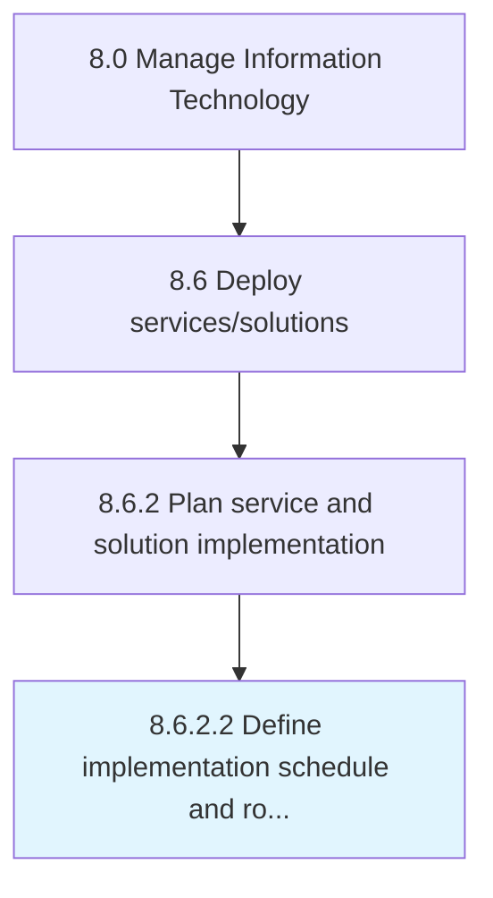

# Define implementation schedule and roll-out sequence

> Defining the schedule for implementation of change.

## Overview

Activity 8.6.2.2 is an activity within the Manage Information Technology framework. 

Defining the schedule for implementation of change. Plan and carry out a process or procedure to implement the predefined changes.

## Process Hierarchy



## Key Statistics

| Metric | Value |
|--------|-------|
| APQC Code | 20834 |
| Hierarchy ID | 8.6.2.2 |
| Level | Activity |
| Parent | [8.6.2](../) |
| Sub-Processes | 0 |


## GraphDL Semantic Structure

```
define.ImplementationScheduleAndRolloutSequence
```

| Component | Value | Description |
|-----------|-------|-------------|
| Verb | `define` | Primary action |
| Object | `implementation schedule and roll-out sequence` | Direct object |


---

*Source: APQC PCF 20834 (8.6.2.2) - APQC*
