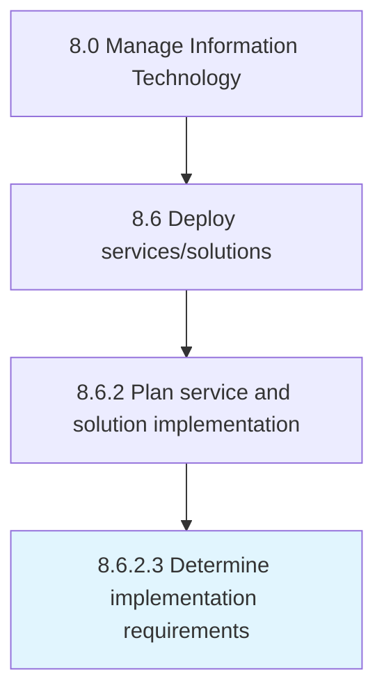

# Determine implementation requirements

> Determine requirements for implementation of IT deployment.

## Overview

Activity 8.6.2.3 is an activity within the Manage Information Technology framework. 

Determine requirements for implementation of IT deployment. Carry out a pre-implementation audit to assess the impact and use case. Gauge the possible vulnerabilities and impact the business operations during and after the implementation.

## Process Hierarchy



## Key Statistics

| Metric | Value |
|--------|-------|
| APQC Code | 20835 |
| Hierarchy ID | 8.6.2.3 |
| Level | Activity |
| Parent | [8.6.2](../) |
| Sub-Processes | 0 |


## GraphDL Semantic Structure

```
determine.ImplementationRequirements
```

| Component | Value | Description |
|-----------|-------|-------------|
| Verb | `determine` | Primary action |
| Object | `implementation requirements` | Direct object |


## Related Concepts

- ImplementationRequirements


---

*Source: APQC PCF 20835 (8.6.2.3) - APQC*
