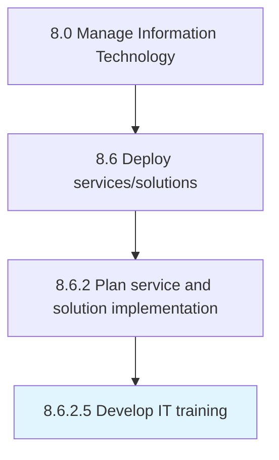

# Develop IT training

> Create and manage employee training programs by considering the need and availability of these programs.

## Overview

Activity 8.6.2.5 is an activity within the Manage Information Technology framework. 

Create and manage employee training programs by considering the need and availability of these programs. Manage all aspects related to the training programs.

## Process Hierarchy



## Key Statistics

| Metric | Value |
|--------|-------|
| APQC Code | 20837 |
| Hierarchy ID | 8.6.2.5 |
| Level | Activity |
| Parent | [8.6.2](../) |
| Sub-Processes | 0 |


## GraphDL Semantic Structure

```
develop.ITTraining
```

| Component | Value | Description |
|-----------|-------|-------------|
| Verb | `develop` | Primary action |
| Object | `IT training` | Direct object |


## Related Concepts

- ITTraining


---

*Source: APQC PCF 20837 (8.6.2.5) - APQC*
