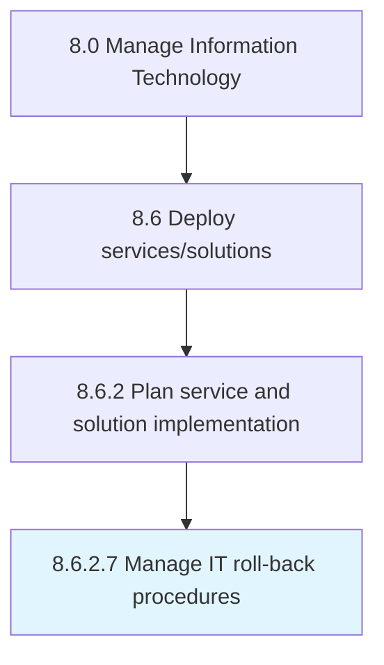

# Manage IT roll-back procedures

> Managing procedures to return to initial pre-deployment stage or previous state from current environment.

## Overview

Activity 8.6.2.7 is an activity within the Manage Information Technology framework. 

Managing procedures to return to initial pre-deployment stage or previous state from current environment.

## Process Hierarchy



## Key Statistics

| Metric | Value |
|--------|-------|
| APQC Code | 20839 |
| Hierarchy ID | 8.6.2.7 |
| Level | Activity |
| Parent | [8.6.2](../) |
| Sub-Processes | 0 |


## GraphDL Semantic Structure

```
manage.ITRollbackProcedures
```

| Component | Value | Description |
|-----------|-------|-------------|
| Verb | `manage` | Primary action |
| Object | `IT roll-back procedures` | Direct object |


---

*Source: APQC PCF 20839 (8.6.2.7) - APQC*
