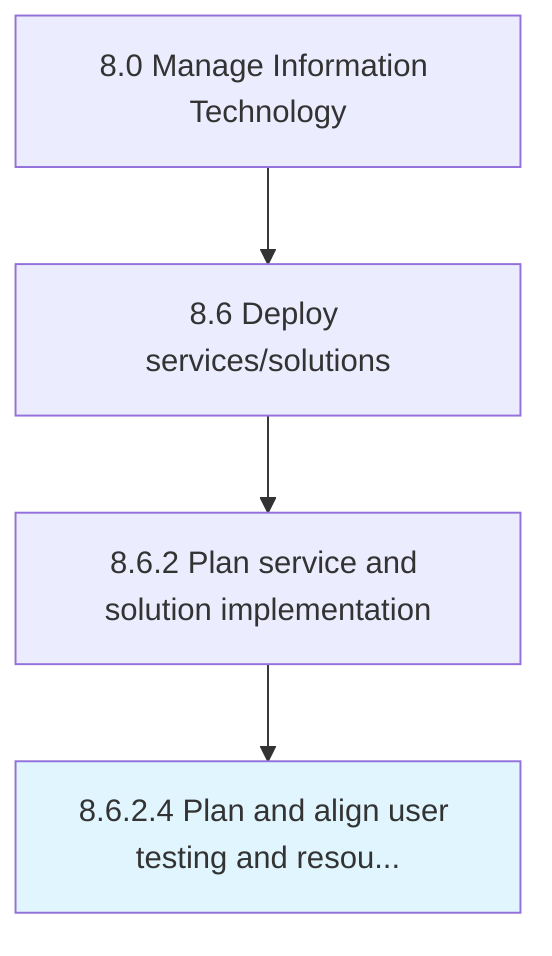

# Plan and align user testing and resources

> Plan methodologies and align resources for user testing of IT deployment.

## Overview

Activity 8.6.2.4 is an activity within the Manage Information Technology framework. 

Plan methodologies and align resources for user testing of IT deployment.

## Process Hierarchy



## Key Statistics

| Metric | Value |
|--------|-------|
| APQC Code | 20836 |
| Hierarchy ID | 8.6.2.4 |
| Level | Activity |
| Parent | [8.6.2](../) |
| Sub-Processes | 0 |


## GraphDL Semantic Structure

```
plan.AndAlignUserTestingAndResources
```

| Component | Value | Description |
|-----------|-------|-------------|
| Verb | `plan` | Primary action |
| Object | `and align user testing and resources` | Direct object |


## Related Concepts

- [UserTesting](/concepts/UserTesting)
- [Resources](/concepts/Resources)
- [UserTesting](/concepts/UserTesting)
- [Resources](/concepts/Resources)


---

*Source: APQC PCF 20836 (8.6.2.4) - APQC*
