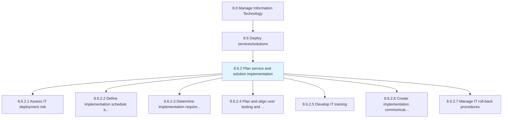
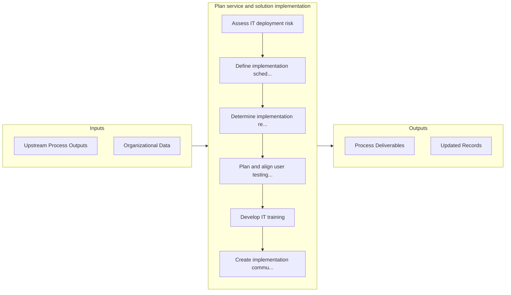

# Plan service and solution implementation

> Strategizing and executing changes in IT solutions and services.

## Overview

Process 8.6.2 is a core process that defines the specific procedures for plan service and solution implementation. 

Strategizing and executing changes in IT solutions and services. Create a plan for deploying the changes. Communicate with stakeholders about the changes. Administer and implement the changes. Train the resources who will be affected by these changes. Install changes and verify their effect.

## Process Hierarchy



## Key Statistics

| Metric | Value |
|--------|-------|
| APQC Code | 20832 |
| Hierarchy ID | 8.6.2 |
| Level | Process |
| Parent | [8.6](../) |
| Sub-Processes | 7 |


## GraphDL Semantic Structure

```
plan.ServiceAndSolutionImplementation
```

| Component | Value | Description |
|-----------|-------|-------------|
| Verb | `plan` | Primary action |
| Object | `service and solution implementation` | Direct object |


## Process Flow



## Sub-Processes

| Process | Hierarchy ID | Description |
|---------|-------------|-------------|
| [Assess IT deployment risk](./AssessITDeploymentRisk) | 8.6.2.1 | Accessing threats and potential failures related to the deployment of IT services/solutions |
| [Define implementation schedule and roll-out sequence](./DefineImplementationScheduleAndRolloutSequence) | 8.6.2.2 | Defining the schedule for implementation of change |
| [Determine implementation requirements](./DetermineImplementationRequirements) | 8.6.2.3 | Determine requirements for implementation of IT deployment |
| [Plan and align user testing and resources](./PlanAndAlignUserTestingAndResources) | 8.6.2.4 | Plan methodologies and align resources for user testing of IT deployment |
| [Develop IT training](./DevelopITTraining) | 8.6.2.5 | Create and manage employee training programs by considering the need and availability of these progr |
| [Create implementation communications](./CreateImplementationCommunications) | 8.6.2.6 | Coordinating change implementation in IT services and solutions communications with employees and st |
| [Manage IT roll-back procedures](./ManageITRollbackProcedures) | 8.6.2.7 | Managing procedures to return to initial pre-deployment stage or previous state from current environ |


## Related Concepts

- Service
- SolutionImplementation


---

*Source: APQC PCF 20832 (8.6.2) - APQC*
