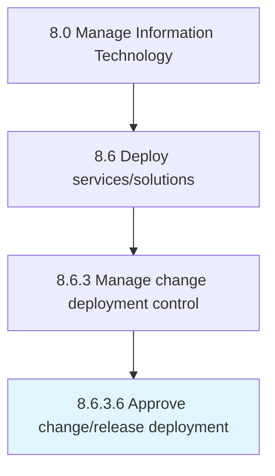

# Approve change/release deployment

> Permitting for the change/release deployment.

## Overview

Activity 8.6.3.6 is an activity within the Manage Information Technology framework. 

Permitting for the change/release deployment. Approve deployment based on the evaluation of business impact due to change/release.

## Process Hierarchy



## Key Statistics

| Metric | Value |
|--------|-------|
| APQC Code | 20846 |
| Hierarchy ID | 8.6.3.6 |
| Level | Activity |
| Parent | [8.6.3](../) |
| Sub-Processes | 0 |


## GraphDL Semantic Structure

```
approve.ChangereleaseDeployment
```

| Component | Value | Description |
|-----------|-------|-------------|
| Verb | `approve` | Primary action |
| Object | `change/release deployment` | Direct object |


## Related Concepts

- ChangeDeployment
- ReleaseDeployment


---

*Source: APQC PCF 20846 (8.6.3.6) - APQC*
