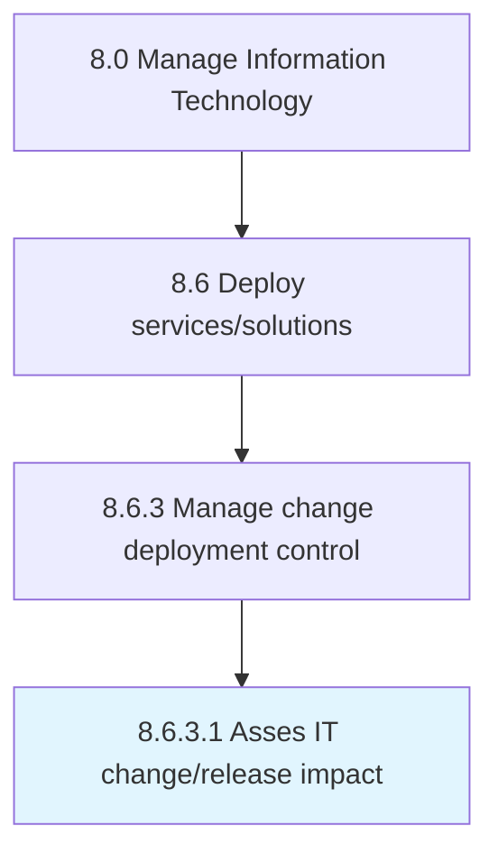

# Asses IT change/release impact

> Evaluating the impact of IT change/release on the business.

## Overview

Activity 8.6.3.1 is an activity within the Manage Information Technology framework. 

Evaluating the impact of IT change/release on the business.

## Process Hierarchy



## Key Statistics

| Metric | Value |
|--------|-------|
| APQC Code | 20841 |
| Hierarchy ID | 8.6.3.1 |
| Level | Activity |
| Parent | [8.6.3](../) |
| Sub-Processes | 0 |


## GraphDL Semantic Structure

```
asses.ITChangereleaseImpact
```

| Component | Value | Description |
|-----------|-------|-------------|
| Verb | `asses` | Primary action |
| Object | `IT change/release impact` | Direct object |


## Related Concepts

- [ITChangeImpact](/concepts/ITChangeImpact)
- [ITReleaseImpact](/concepts/ITReleaseImpact)


---

*Source: APQC PCF 20841 (8.6.3.1) - APQC*
