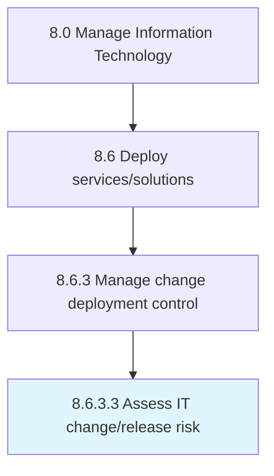

# Assess IT change/release risk

> Evaluating for any kind of risks or threats which could be caused due to IT change/release deployment.

## Overview

Activity 8.6.3.3 is an activity within the Manage Information Technology framework. 

Evaluating for any kind of risks or threats which could be caused due to IT change/release deployment.

## Process Hierarchy



## Key Statistics

| Metric | Value |
|--------|-------|
| APQC Code | 20843 |
| Hierarchy ID | 8.6.3.3 |
| Level | Activity |
| Parent | [8.6.3](../) |
| Sub-Processes | 0 |


## GraphDL Semantic Structure

```
assess.ITChangereleaseRisk
```

| Component | Value | Description |
|-----------|-------|-------------|
| Verb | `assess` | Primary action |
| Object | `IT change/release risk` | Direct object |


## Related Concepts

- ITChangeRisk
- ITReleaseRisk


---

*Source: APQC PCF 20843 (8.6.3.3) - APQC*
