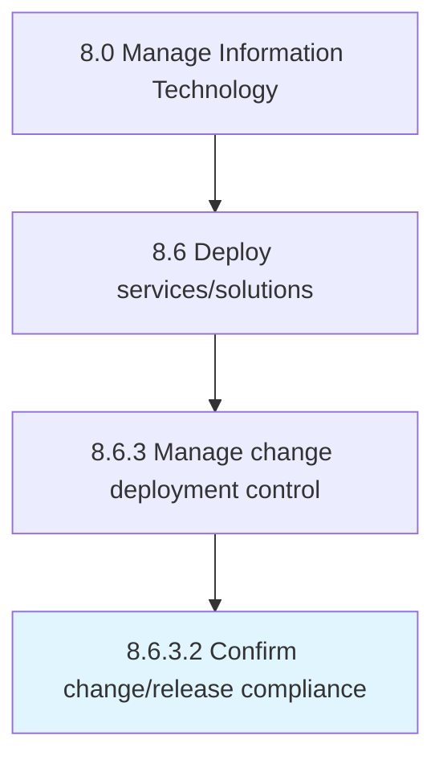

# Confirm change/release compliance

> Ensure that change/release meets change guidelines set by the organization.

## Overview

Activity 8.6.3.2 is an activity within the Manage Information Technology framework. 

Ensure that change/release meets change guidelines set by the organization.

## Process Hierarchy



## Key Statistics

| Metric | Value |
|--------|-------|
| APQC Code | 20842 |
| Hierarchy ID | 8.6.3.2 |
| Level | Activity |
| Parent | [8.6.3](../) |
| Sub-Processes | 0 |


## GraphDL Semantic Structure

```
confirm.ChangereleaseCompliance
```

| Component | Value | Description |
|-----------|-------|-------------|
| Verb | `confirm` | Primary action |
| Object | `change/release compliance` | Direct object |


## Related Concepts

- ChangeCompliance
- ReleaseCompliance


---

*Source: APQC PCF 20842 (8.6.3.2) - APQC*
