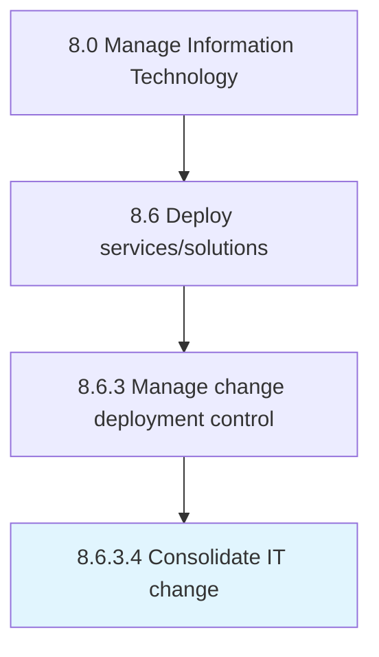

# Consolidate IT change

> Integrate all forms of changes in IT in order to make more efficient use of resources and down time, and optimizing results.

## Overview

Activity 8.6.3.4 is an activity within the Manage Information Technology framework. 

Integrate all forms of changes in IT in order to make more efficient use of resources and down time, and optimizing results.

## Process Hierarchy



## Key Statistics

| Metric | Value |
|--------|-------|
| APQC Code | 20844 |
| Hierarchy ID | 8.6.3.4 |
| Level | Activity |
| Parent | [8.6.3](../) |
| Sub-Processes | 0 |


## GraphDL Semantic Structure

```
consolidate.ITChange
```

| Component | Value | Description |
|-----------|-------|-------------|
| Verb | `consolidate` | Primary action |
| Object | `IT change` | Direct object |


## Related Concepts

- ITChange


---

*Source: APQC PCF 20844 (8.6.3.4) - APQC*
