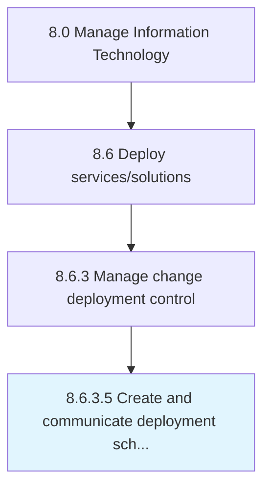

# Create and communicate deployment schedule

> Defining and communicating the schedule for implementation to related stakeholders and functions.

## Overview

Activity 8.6.3.5 is an activity within the Manage Information Technology framework. 

Defining and communicating the schedule for implementation to related stakeholders and functions.

## Process Hierarchy



## Key Statistics

| Metric | Value |
|--------|-------|
| APQC Code | 20845 |
| Hierarchy ID | 8.6.3.5 |
| Level | Activity |
| Parent | [8.6.3](../) |
| Sub-Processes | 0 |


## GraphDL Semantic Structure

```
create.AndCommunicateDeploymentSchedule
```

| Component | Value | Description |
|-----------|-------|-------------|
| Verb | `create` | Primary action |
| Object | `and communicate deployment schedule` | Direct object |


## Related Concepts

- [DeploymentSchedule](/concepts/DeploymentSchedule)
- [DeploymentSchedule](/concepts/DeploymentSchedule)


---

*Source: APQC PCF 20845 (8.6.3.5) - APQC*
