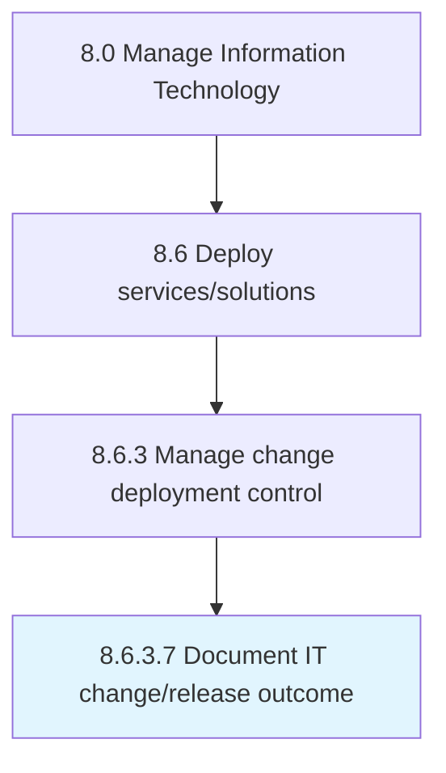

# Document IT change/release outcome

> Recording outcomes related to the change/release deployment.

## Overview

Activity 8.6.3.7 is an activity within the Manage Information Technology framework. 

Recording outcomes related to the change/release deployment.

## Process Hierarchy



## Key Statistics

| Metric | Value |
|--------|-------|
| APQC Code | 20847 |
| Hierarchy ID | 8.6.3.7 |
| Level | Activity |
| Parent | [8.6.3](../) |
| Sub-Processes | 0 |


## GraphDL Semantic Structure

```
document.ITChangereleaseOutcome
```

| Component | Value | Description |
|-----------|-------|-------------|
| Verb | `document` | Primary action |
| Object | `IT change/release outcome` | Direct object |


## Related Concepts

- [ITChangeOutcome](/concepts/ITChangeOutcome)
- [ITReleaseOutcome](/concepts/ITReleaseOutcome)


---

*Source: APQC PCF 20847 (8.6.3.7) - APQC*
