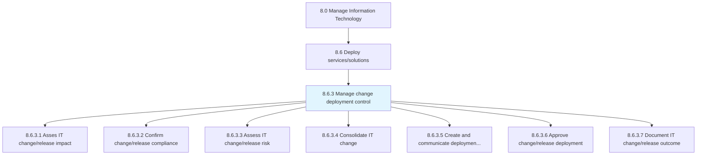
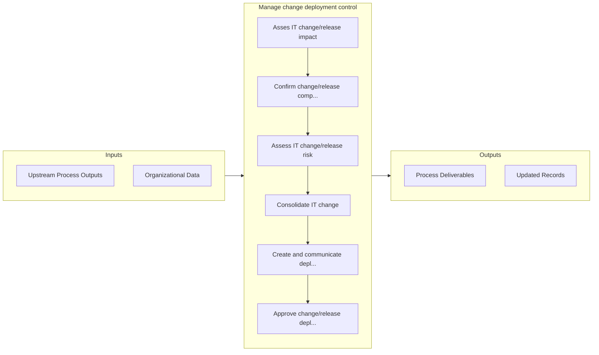

# Manage change deployment control

> Creating and deploying an architecture for securing the changes deployed in the organization.

## Overview

Process 8.6.3 is a core process that defines the specific procedures for manage change deployment control. 

Creating and deploying an architecture for securing the changes deployed in the organization. Create and develop protocols that ensure proper and efficient use of deployed IT services and solutions. Test, evaluate, and implement the policies and protocols.

## Process Hierarchy



## Key Statistics

| Metric | Value |
|--------|-------|
| APQC Code | 20840 |
| Hierarchy ID | 8.6.3 |
| Level | Process |
| Parent | [8.6](../) |
| Sub-Processes | 7 |


## GraphDL Semantic Structure

```
manage.ChangeDeploymentControl
```

| Component | Value | Description |
|-----------|-------|-------------|
| Verb | `manage` | Primary action |
| Object | `change deployment control` | Direct object |


## Process Flow



## Sub-Processes

| Process | Hierarchy ID | Description |
|---------|-------------|-------------|
| [Asses IT change/release impact](./AssesITChangereleaseImpact) | 8.6.3.1 | Evaluating the impact of IT change/release on the business |
| [Confirm change/release compliance](./ConfirmChangereleaseCompliance) | 8.6.3.2 | Ensure that change/release meets change guidelines set by the organization |
| [Assess IT change/release risk](./AssessITChangereleaseRisk) | 8.6.3.3 | Evaluating for any kind of risks or threats which could be caused due to IT change/release deploymen |
| [Consolidate IT change](./ConsolidateITChange) | 8.6.3.4 | Integrate all forms of changes in IT in order to make more efficient use of resources and down time, |
| [Create and communicate deployment schedule](./CreateAndCommunicateDeploymentSchedule) | 8.6.3.5 | Defining and communicating the schedule for implementation to related stakeholders and functions |
| [Approve change/release deployment](./ApproveChangereleaseDeployment) | 8.6.3.6 | Permitting for the change/release deployment |
| [Document IT change/release outcome](./DocumentITChangereleaseOutcome) | 8.6.3.7 | Recording outcomes related to the change/release deployment |


## Related Concepts

- ChangeDeploymentControl


---

*Source: APQC PCF 20840 (8.6.3) - APQC*
