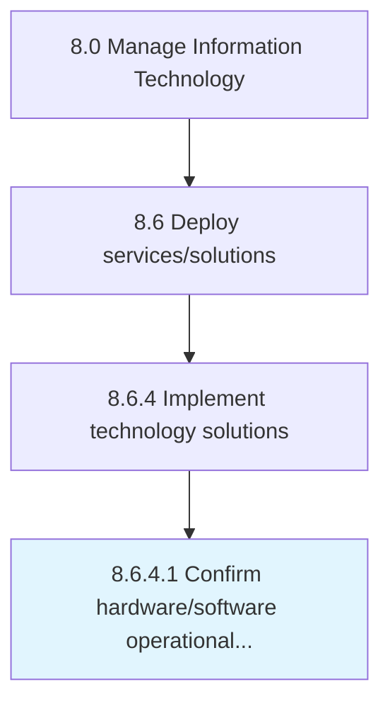

# Confirm hardware/software operational status

> Confirm if hardware/software are operating as per the expectation.

## Overview

Activity 8.6.4.1 is an activity within the Manage Information Technology framework. 

Confirm if hardware/software are operating as per the expectation.

## Process Hierarchy



## Key Statistics

| Metric | Value |
|--------|-------|
| APQC Code | 20849 |
| Hierarchy ID | 8.6.4.1 |
| Level | Activity |
| Parent | [8.6.4](../) |
| Sub-Processes | 0 |


## GraphDL Semantic Structure

```
confirm.HardwaresoftwareOperationalStatus
```

| Component | Value | Description |
|-----------|-------|-------------|
| Verb | `confirm` | Primary action |
| Object | `hardware/software operational status` | Direct object |


## Related Concepts

- [HardwareOperationalStatus](/concepts/HardwareOperationalStatus)
- [SoftwareOperationalStatus](/concepts/SoftwareOperationalStatus)


---

*Source: APQC PCF 20849 (8.6.4.1) - APQC*
