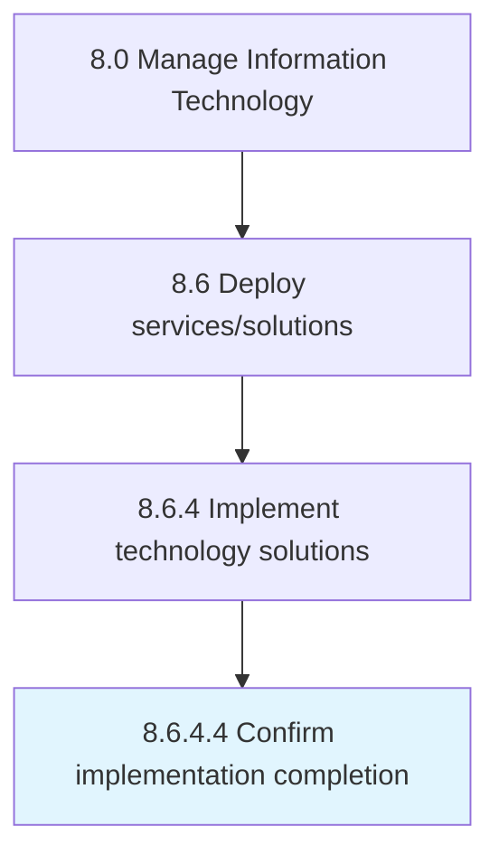

# Confirm implementation completion

> Confirming the completion of IT implementation.

## Overview

Activity 8.6.4.4 is an activity within the Manage Information Technology framework. 

## Process Hierarchy



## Key Statistics

| Metric | Value |
|--------|-------|
| APQC Code | 20852 |
| Hierarchy ID | 8.6.4.4 |
| Level | Activity |
| Parent | [8.6.4](../) |
| Sub-Processes | 0 |


## GraphDL Semantic Structure

```
confirm.ImplementationCompletion
```

| Component | Value | Description |
|-----------|-------|-------------|
| Verb | `confirm` | Primary action |
| Object | `implementation completion` | Direct object |


## Related Concepts

- ImplementationCompletion


---

*Source: APQC PCF 20852 (8.6.4.4) - APQC*
