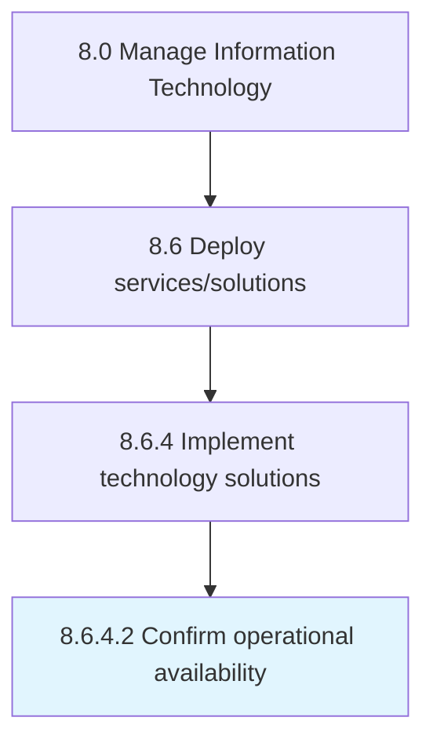

# Confirm operational availability

> Confirm if operational activities of IT services could be performed.

## Overview

Activity 8.6.4.2 is an activity within the Manage Information Technology framework. 

Confirm if operational activities of IT services could be performed.

## Process Hierarchy



## Key Statistics

| Metric | Value |
|--------|-------|
| APQC Code | 20850 |
| Hierarchy ID | 8.6.4.2 |
| Level | Activity |
| Parent | [8.6.4](../) |
| Sub-Processes | 0 |


## GraphDL Semantic Structure

```
confirm.OperationalAvailability
```

| Component | Value | Description |
|-----------|-------|-------------|
| Verb | `confirm` | Primary action |
| Object | `operational availability` | Direct object |


## Related Concepts

- [OperationalAvailability](/concepts/OperationalAvailability)


---

*Source: APQC PCF 20850 (8.6.4.2) - APQC*
