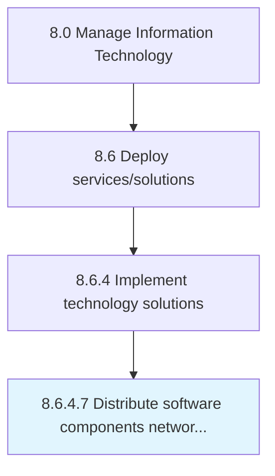

# Distribute software components network-wide

> Distributing and implementing the release of changed IT solutions.

## Overview

Activity 8.6.4.7 is an activity within the Manage Information Technology framework. 

Distributing and implementing the release of changed IT solutions. Administer, implement, and install the releases onto internal systems. Provide methods for installing releases on client users.

## Process Hierarchy



## Key Statistics

| Metric | Value |
|--------|-------|
| APQC Code | 20855 |
| Hierarchy ID | 8.6.4.7 |
| Level | Activity |
| Parent | [8.6.4](../) |
| Sub-Processes | 0 |


## GraphDL Semantic Structure

```
distribute.SoftwareComponentsNetworkwide
```

| Component | Value | Description |
|-----------|-------|-------------|
| Verb | `distribute` | Primary action |
| Object | `software components network-wide` | Direct object |


---

*Source: APQC PCF 20855 (8.6.4.7) - APQC*
