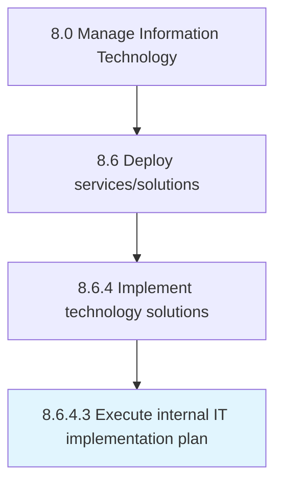

# Execute internal IT implementation plan

> Executing IT implementation plan to make the IT services and solutions available for internal use.

## Overview

Activity 8.6.4.3 is an activity within the Manage Information Technology framework. 

Executing IT implementation plan to make the IT services and solutions available for internal use.

## Process Hierarchy



## Key Statistics

| Metric | Value |
|--------|-------|
| APQC Code | 20851 |
| Hierarchy ID | 8.6.4.3 |
| Level | Activity |
| Parent | [8.6.4](../) |
| Sub-Processes | 0 |


## GraphDL Semantic Structure

```
execute.InternalITImplementationPlan
```

| Component | Value | Description |
|-----------|-------|-------------|
| Verb | `execute` | Primary action |
| Object | `internal IT implementation plan` | Direct object |


## Related Concepts

- [InternalITImplementationPlan](/concepts/InternalITImplementationPlan)


---

*Source: APQC PCF 20851 (8.6.4.3) - APQC*
