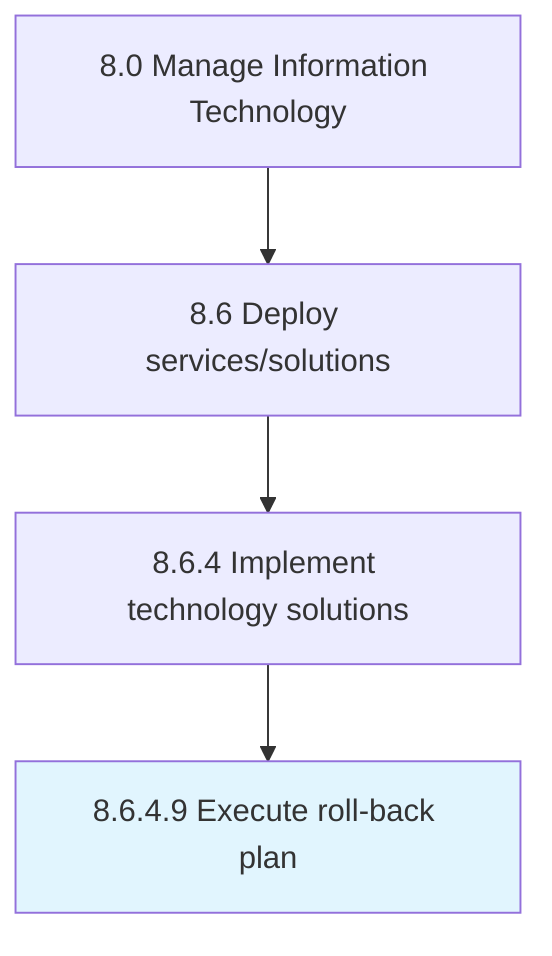

# Execute roll-back plan

> Execution of plan to return to the previous operating state if the change/release impedes operational expectations.

## Overview

Activity 8.6.4.9 is an activity within the Manage Information Technology framework. 

Execution of plan to return to the previous operating state if the change/release impedes operational expectations.

## Process Hierarchy



## Key Statistics

| Metric | Value |
|--------|-------|
| APQC Code | 20857 |
| Hierarchy ID | 8.6.4.9 |
| Level | Activity |
| Parent | [8.6.4](../) |
| Sub-Processes | 0 |


## GraphDL Semantic Structure

```
execute.RollbackPlan
```

| Component | Value | Description |
|-----------|-------|-------------|
| Verb | `execute` | Primary action |
| Object | `roll-back plan` | Direct object |


---

*Source: APQC PCF 20857 (8.6.4.9) - APQC*
