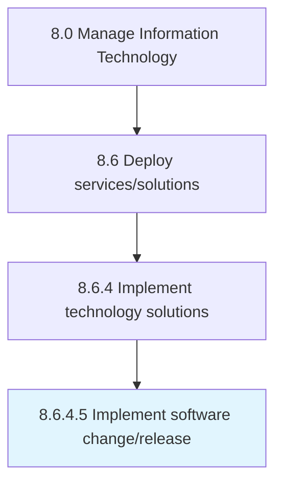

# Implement software change/release

> Executing changes in software and services as per change/release schedule.

## Overview

Activity 8.6.4.5 is an activity within the Manage Information Technology framework. 

Executing changes in software and services as per change/release schedule.

## Process Hierarchy



## Key Statistics

| Metric | Value |
|--------|-------|
| APQC Code | 20853 |
| Hierarchy ID | 8.6.4.5 |
| Level | Activity |
| Parent | [8.6.4](../) |
| Sub-Processes | 0 |


## GraphDL Semantic Structure

```
implement.SoftwareChangerelease
```

| Component | Value | Description |
|-----------|-------|-------------|
| Verb | `implement` | Primary action |
| Object | `software change/release` | Direct object |


## Related Concepts

- SoftwareChange
- SoftwareRelease


---

*Source: APQC PCF 20853 (8.6.4.5) - APQC*
