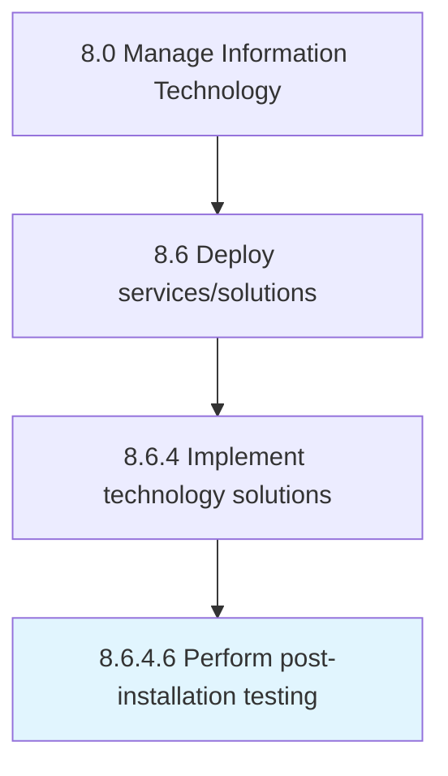

# Perform post-installation testing

> Perform testing after installation to confirm expected performance is met.

## Overview

Activity 8.6.4.6 is an activity within the Manage Information Technology framework. 

Perform testing after installation to confirm expected performance is met.

## Process Hierarchy



## Key Statistics

| Metric | Value |
|--------|-------|
| APQC Code | 20854 |
| Hierarchy ID | 8.6.4.6 |
| Level | Activity |
| Parent | [8.6.4](../) |
| Sub-Processes | 0 |


## GraphDL Semantic Structure

```
perform.PostinstallationTesting
```

| Component | Value | Description |
|-----------|-------|-------------|
| Verb | `perform` | Primary action |
| Object | `post-installation testing` | Direct object |


---

*Source: APQC PCF 20854 (8.6.4.6) - APQC*
