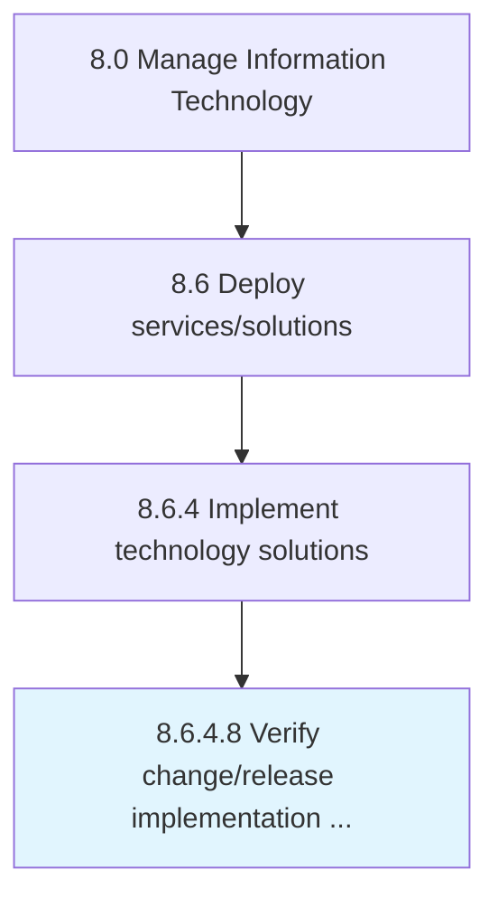

# Verify change/release implementation success

> Confirming that the release has met expectations.

## Overview

Activity 8.6.4.8 is an activity within the Manage Information Technology framework. 

## Process Hierarchy



## Key Statistics

| Metric | Value |
|--------|-------|
| APQC Code | 20856 |
| Hierarchy ID | 8.6.4.8 |
| Level | Activity |
| Parent | [8.6.4](../) |
| Sub-Processes | 0 |


## GraphDL Semantic Structure

```
verify.ChangereleaseImplementationSuccess
```

| Component | Value | Description |
|-----------|-------|-------------|
| Verb | `verify` | Primary action |
| Object | `change/release implementation success` | Direct object |


## Related Concepts

- [ChangeImplementationSuccess](/concepts/ChangeImplementationSuccess)
- [ReleaseImplementationSuccess](/concepts/ReleaseImplementationSuccess)


---

*Source: APQC PCF 20856 (8.6.4.8) - APQC*
