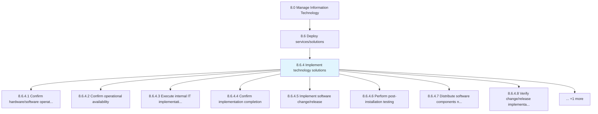
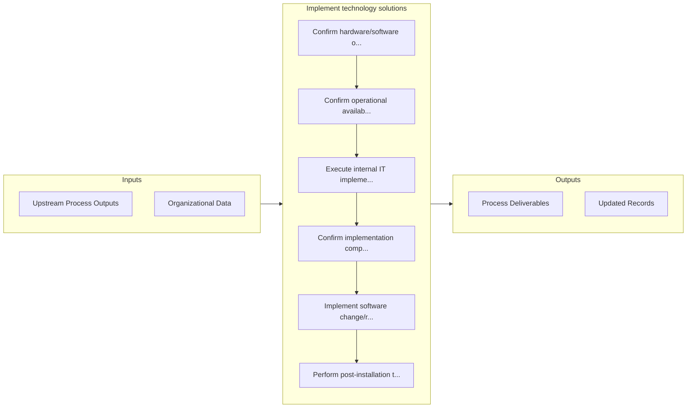

# Implement technology solutions

> Deploy the identified solutions for information technology important for healthy business operations.

## Overview

Process 8.6.4 is a core process that defines the specific procedures for implement technology solutions. 

Deploy the identified solutions for information technology important for healthy business operations. Confirm status and operational availability of IT resources. Perform testing and distribution of change. Execute roll-back protocol if necessary.

## Process Hierarchy



## Key Statistics

| Metric | Value |
|--------|-------|
| APQC Code | 20848 |
| Hierarchy ID | 8.6.4 |
| Level | Process |
| Parent | [8.6](../) |
| Sub-Processes | 9 |


## GraphDL Semantic Structure

```graphdl
implement.TechnologySolutions
```

| Component | Value | Description |
|-----------|-------|-------------|
| Verb | `implement` | Primary action |
| Object | `technology solutions` | Direct object |


## Process Flow



## Sub-Processes

| Process | Hierarchy ID | Description |
|---------|-------------|-------------|
| [Confirm hardware/software operational status](./ConfirmHardwaresoftwareOperationalStatus) | 8.6.4.1 | Confirm if hardware/software are operating as per the expectation |
| [Confirm operational availability](./ConfirmOperationalAvailability) | 8.6.4.2 | Confirm if operational activities of IT services could be performed |
| [Execute internal IT implementation plan](./ExecuteInternalITImplementationPlan) | 8.6.4.3 | Executing IT implementation plan to make the IT services and solutions available for internal use |
| [Confirm implementation completion](./ConfirmImplementationCompletion) | 8.6.4.4 | Confirming the completion of IT implementation |
| [Implement software change/release](./ImplementSoftwareChangerelease) | 8.6.4.5 | Executing changes in software and services as per change/release schedule |
| [Perform post-installation testing](./PerformPostinstallationTesting) | 8.6.4.6 | Perform testing after installation to confirm expected performance is met |
| [Distribute software components network-wide](./DistributeSoftwareComponentsNetworkwide) | 8.6.4.7 | Distributing and implementing the release of changed IT solutions |
| [Verify change/release implementation success](./VerifyChangereleaseImplementationSuccess) | 8.6.4.8 | Confirming that the release has met expectations |
| [Execute roll-back plan](./ExecuteRollbackPlan) | 8.6.4.9 | Execution of plan to return to the previous operating state if the change/release impedes operationa |


## Related Concepts

- TechnologySolutions


---

*Source: APQC PCF 20848 (8.6.4) - APQC*
