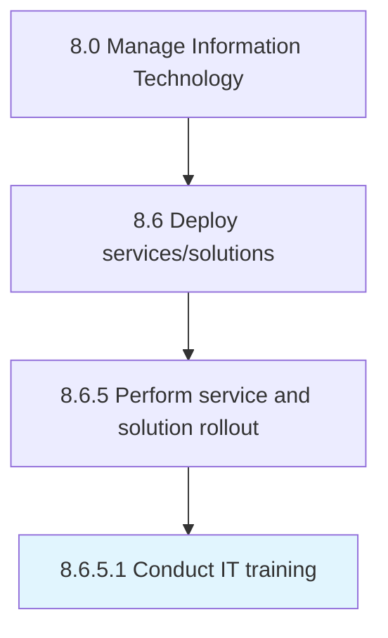

# Conduct IT training

> Preparing users for changes in IT solutions.

## Overview

Activity 8.6.5.1 is an activity within the Manage Information Technology framework. 

Preparing users for changes in IT solutions. Conduct training sessions and engagement activities to familiarize users with the new changes. Implementing the programs for training IT employees.

## Process Hierarchy



## Key Statistics

| Metric | Value |
|--------|-------|
| APQC Code | 20859 |
| Hierarchy ID | 8.6.5.1 |
| Level | Activity |
| Parent | [8.6.5](../) |
| Sub-Processes | 0 |


## GraphDL Semantic Structure

```
conduct.ITTraining
```

| Component | Value | Description |
|-----------|-------|-------------|
| Verb | `conduct` | Primary action |
| Object | `IT training` | Direct object |


## Related Concepts

- ITTraining


---

*Source: APQC PCF 20859 (8.6.5.1) - APQC*
