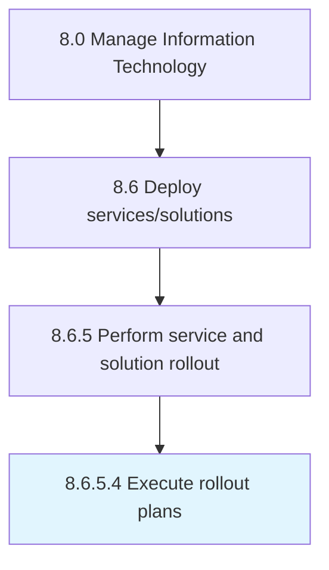

# Execute rollout plans

> Executing a plan for introducing the IT services and solutions to the organization's end user base.

## Overview

Activity 8.6.5.4 is an activity within the Manage Information Technology framework. 

Executing a plan for introducing the IT services and solutions to the organization's end user base.

## Process Hierarchy



## Key Statistics

| Metric | Value |
|--------|-------|
| APQC Code | 20862 |
| Hierarchy ID | 8.6.5.4 |
| Level | Activity |
| Parent | [8.6.5](../) |
| Sub-Processes | 0 |


## GraphDL Semantic Structure

```
execute.RolloutPlans
```

| Component | Value | Description |
|-----------|-------|-------------|
| Verb | `execute` | Primary action |
| Object | `rollout plans` | Direct object |


## Related Concepts

- [RolloutPlans](/concepts/RolloutPlans)


---

*Source: APQC PCF 20862 (8.6.5.4) - APQC*
