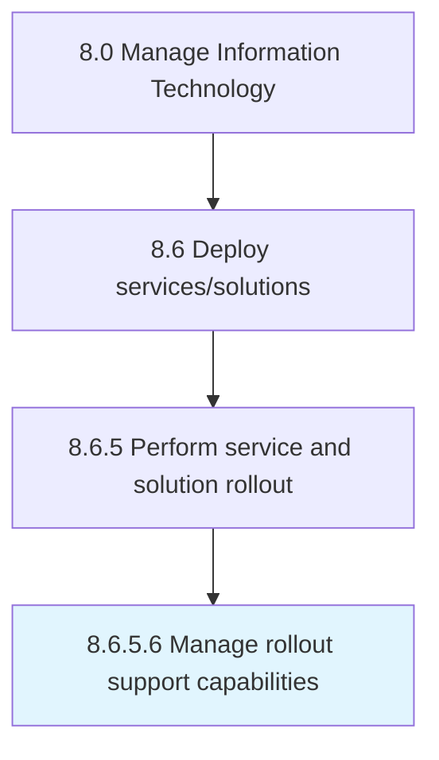

# Manage rollout support capabilities

> Managing the necessary skills and competencies required to efficiently provide IT resolution for rollout through the support structure.

## Overview

Activity 8.6.5.6 is an activity within the Manage Information Technology framework. 

Managing the necessary skills and competencies required to efficiently provide IT resolution for rollout through the support structure. Identify the gaps and needs in support structure.

## Process Hierarchy



## Key Statistics

| Metric | Value |
|--------|-------|
| APQC Code | 20864 |
| Hierarchy ID | 8.6.5.6 |
| Level | Activity |
| Parent | [8.6.5](../) |
| Sub-Processes | 0 |


## GraphDL Semantic Structure

```
manage.RolloutSupportCapabilities
```

| Component | Value | Description |
|-----------|-------|-------------|
| Verb | `manage` | Primary action |
| Object | `rollout support capabilities` | Direct object |


## Related Concepts

- [RolloutSupportCapabilities](/concepts/RolloutSupportCapabilities)


---

*Source: APQC PCF 20864 (8.6.5.6) - APQC*
