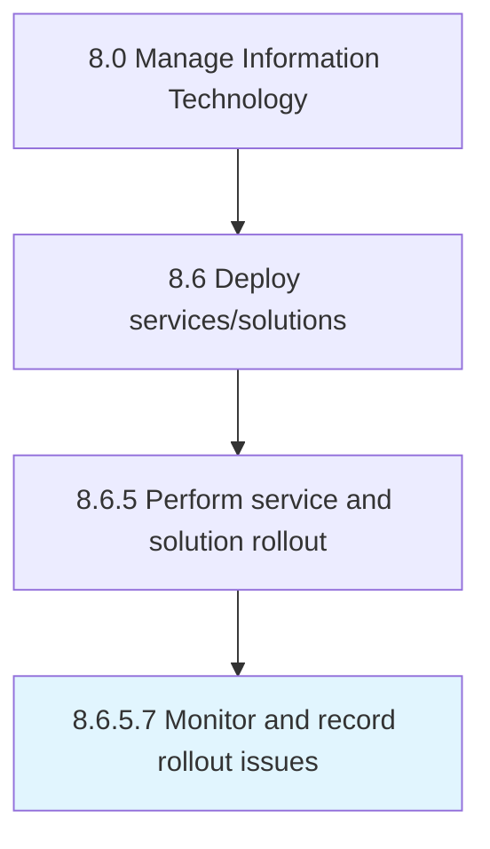

# Monitor and record rollout issues

> Track and record any issues being faced due to rollout.

## Overview

Activity 8.6.5.7 is an activity within the Manage Information Technology framework. 

Track and record any issues being faced due to rollout. Define methodology of assessment for measuring and monitoring issues.

## Process Hierarchy



## Key Statistics

| Metric | Value |
|--------|-------|
| APQC Code | 20865 |
| Hierarchy ID | 8.6.5.7 |
| Level | Activity |
| Parent | [8.6.5](../) |
| Sub-Processes | 0 |


## GraphDL Semantic Structure

```
monitor.AndRecordRolloutIssues
```

| Component | Value | Description |
|-----------|-------|-------------|
| Verb | `monitor` | Primary action |
| Object | `and record rollout issues` | Direct object |


## Related Concepts

- RolloutIssues
- RolloutIssues


---

*Source: APQC PCF 20865 (8.6.5.7) - APQC*
