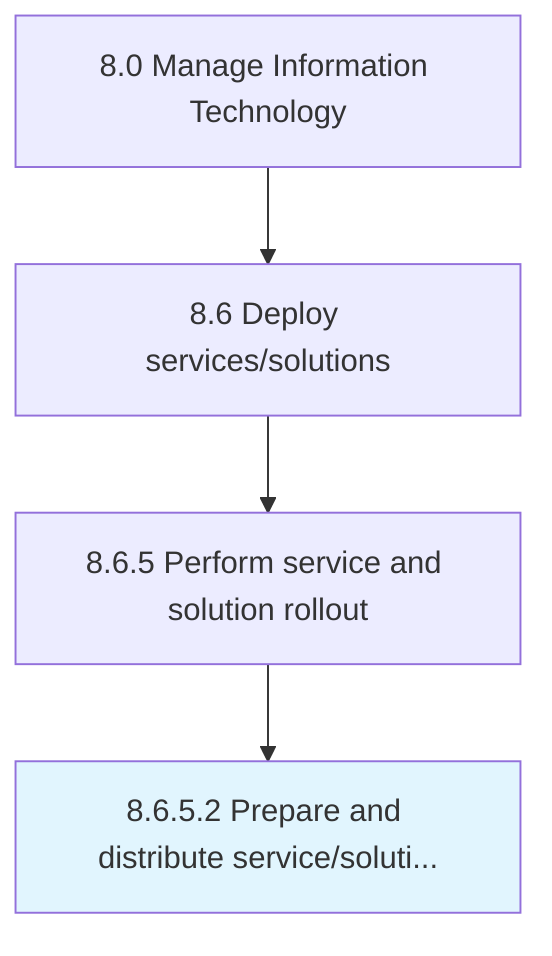

# Prepare and distribute service/solution communications

> Coordinating communications regarding the changes in IT services and solutions with employees in the organization.

## Overview

Activity 8.6.5.2 is an activity within the Manage Information Technology framework. 

Coordinating communications regarding the changes in IT services and solutions with employees in the organization.

## Process Hierarchy



## Key Statistics

| Metric | Value |
|--------|-------|
| APQC Code | 20860 |
| Hierarchy ID | 8.6.5.2 |
| Level | Activity |
| Parent | [8.6.5](../) |
| Sub-Processes | 0 |


## GraphDL Semantic Structure

```
prepare.AndDistributeServicesolutionCommunications
```

| Component | Value | Description |
|-----------|-------|-------------|
| Verb | `prepare` | Primary action |
| Object | `and distribute service/solution communications` | Direct object |


## Related Concepts

- [ServiceCommunications](/concepts/ServiceCommunications)
- [SolutionCommunications](/concepts/SolutionCommunications)
- [ServiceCommunications](/concepts/ServiceCommunications)
- [SolutionCommunications](/concepts/SolutionCommunications)


---

*Source: APQC PCF 20860 (8.6.5.2) - APQC*
