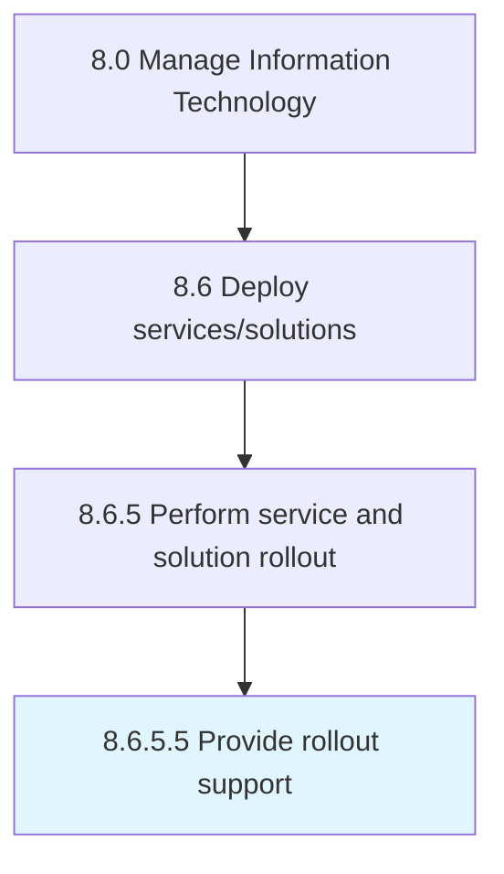

# Provide rollout support

> Establishing services for providing support to users of IT services and solutions for rollout.

## Overview

Activity 8.6.5.5 is an activity within the Manage Information Technology framework. 

Establishing services for providing support to users of IT services and solutions for rollout. Define the plethora of services by which the organization assists users of technology products.

## Process Hierarchy



## Key Statistics

| Metric | Value |
|--------|-------|
| APQC Code | 20863 |
| Hierarchy ID | 8.6.5.5 |
| Level | Activity |
| Parent | [8.6.5](../) |
| Sub-Processes | 0 |


## GraphDL Semantic Structure

```
provide.RolloutSupport
```

| Component | Value | Description |
|-----------|-------|-------------|
| Verb | `provide` | Primary action |
| Object | `rollout support` | Direct object |


## Related Concepts

- [RolloutSupport](/concepts/RolloutSupport)


---

*Source: APQC PCF 20863 (8.6.5.5) - APQC*
