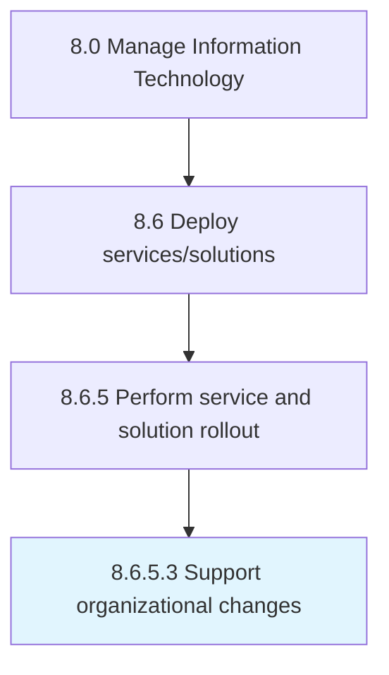

# Support organizational changes

> Creating a strategy for providing support for organizational changes.

## Overview

Activity 8.6.5.3 is an activity within the Manage Information Technology framework. 

Creating a strategy for providing support for organizational changes. Providing support to users of IT services and solutions.

## Process Hierarchy



## Key Statistics

| Metric | Value |
|--------|-------|
| APQC Code | 20861 |
| Hierarchy ID | 8.6.5.3 |
| Level | Activity |
| Parent | [8.6.5](../) |
| Sub-Processes | 0 |


## GraphDL Semantic Structure

```
support.OrganizationalChanges
```

| Component | Value | Description |
|-----------|-------|-------------|
| Verb | `support` | Primary action |
| Object | `organizational changes` | Direct object |


## Related Concepts

- [OrganizationalChanges](/concepts/OrganizationalChanges)


---

*Source: APQC PCF 20861 (8.6.5.3) - APQC*
