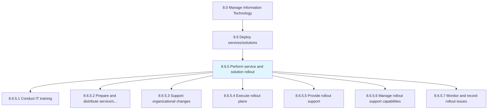
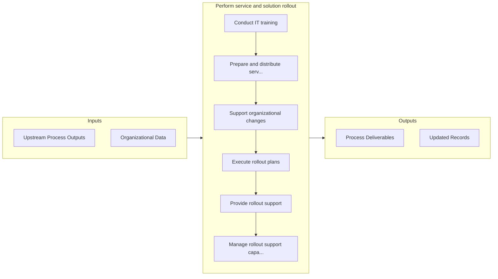

# Perform service and solution rollout

> Strategizing and executing changes in IT solutions and services.

## Overview

Process 8.6.5 is a core process that defines the specific procedures for perform service and solution rollout. 

Strategizing and executing changes in IT solutions and services. Create a plan for deploying the changes. Communicate with stakeholders about the changes. Administer and implement the changes. Train the resources who will be affected by these changes. Install changes and verify their effect.

## Process Hierarchy



## Key Statistics

| Metric | Value |
|--------|-------|
| APQC Code | 20858 |
| Hierarchy ID | 8.6.5 |
| Level | Process |
| Parent | [8.6](../) |
| Sub-Processes | 7 |


## GraphDL Semantic Structure

```
perform.ServiceAndSolutionRollout
```

| Component | Value | Description |
|-----------|-------|-------------|
| Verb | `perform` | Primary action |
| Object | `service and solution rollout` | Direct object |


## Process Flow



## Sub-Processes

| Process | Hierarchy ID | Description |
|---------|-------------|-------------|
| [Conduct IT training](./ConductITTraining) | 8.6.5.1 | Preparing users for changes in IT solutions |
| [Prepare and distribute service/solution communications](./PrepareAndDistributeServicesolutionCommunications) | 8.6.5.2 | Coordinating communications regarding the changes in IT services and solutions with employees in the |
| [Support organizational changes](./SupportOrganizationalChanges) | 8.6.5.3 | Creating a strategy for providing support for organizational changes |
| [Execute rollout plans](./ExecuteRolloutPlans) | 8.6.5.4 | Executing a plan for introducing the IT services and solutions to the organization's end user base |
| [Provide rollout support](./ProvideRolloutSupport) | 8.6.5.5 | Establishing services for providing support to users of IT services and solutions for rollout |
| [Manage rollout support capabilities](./ManageRolloutSupportCapabilities) | 8.6.5.6 | Managing the necessary skills and competencies required to efficiently provide IT resolution for rol |
| [Monitor and record rollout issues](./MonitorAndRecordRolloutIssues) | 8.6.5.7 | Track and record any issues being faced due to rollout |


## Related Concepts

- ServiceRollout
- SolutionRollout


---

*Source: APQC PCF 20858 (8.6.5) - APQC*
