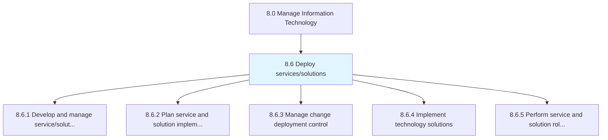
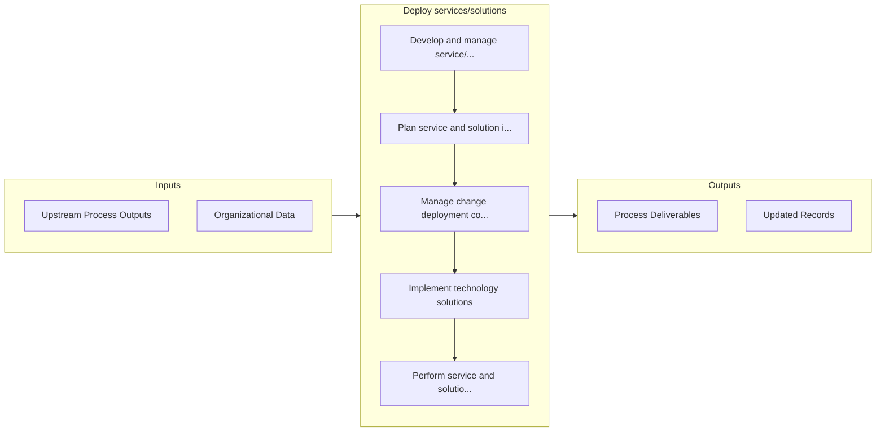

# Deploy services/solutions

> Executing IT services/solutions by creating a strategy for deployment.

## Overview

Group 8.6 is a process group within APQC Category 8.0 (Manage Information Technology). 

Executing IT services/solutions by creating a strategy for deployment. Plan and execute the changes. Plan and administer the release of its IT services and solutions.

## Process Hierarchy



## Key Statistics

| Metric | Value |
|--------|-------|
| APQC Code | 20824 |
| Hierarchy ID | 8.6 |
| Level | Group |
| Parent | [8](../) |
| Sub-Processes | 5 |


## GraphDL Semantic Structure

```
deploy.Servicessolutions
```

| Component | Value | Description |
|-----------|-------|-------------|
| Verb | `deploy` | Primary action |
| Object | `services/solutions` | Direct object |


## Process Flow



## Sub-Processes

| Process | Hierarchy ID | Description |
|---------|-------------|-------------|
| [Develop and manage service/solution deployment strategy](./8.6.1-DevelopManageServicesolutionDeployment/) | 8.6.1 | Creating and implementing a strategy for the deployment of IT service/solution |
| [Plan service and solution implementation](./8.6.2-PlanServiceSolutionImplementation/) | 8.6.2 | Strategizing and executing changes in IT solutions and services |
| [Manage change deployment control](./8.6.3-ManageChangeDeploymentControl/) | 8.6.3 | Creating and deploying an architecture for securing the changes deployed in the organization |
| [Implement technology solutions](./8.6.4-ImplementTechnologySolutions/) | 8.6.4 | Deploy the identified solutions for information technology important for healthy business operations |
| [Perform service and solution rollout](./8.6.5-PerformServiceSolutionRollout/) | 8.6.5 | Strategizing and executing changes in IT solutions and services |


## Related Concepts

- [Services](/concepts/Services)
- [Solutions](/concepts/Solutions)


---

*Source: APQC PCF 20824 (8.6) - APQC*
