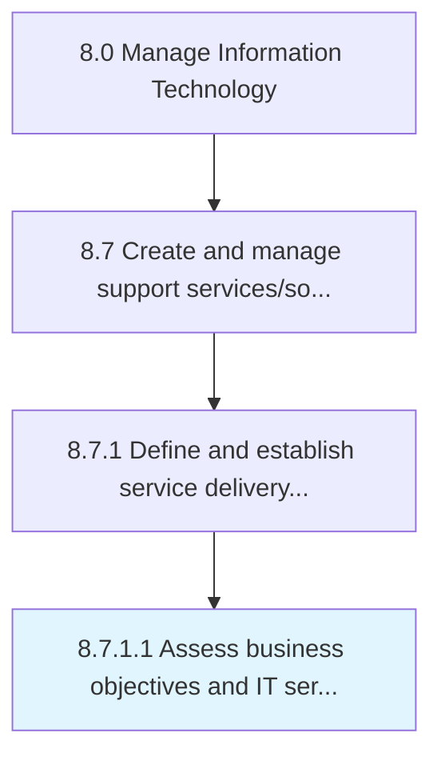

# Assess business objectives and IT service delivery

> Assessing the goals and objectives of IT service delivery and how it contributes to the overall business objectives.

## Overview

Activity 8.7.1.1 is an activity within the Manage Information Technology framework. 

Assessing the goals and objectives of IT service delivery and how it contributes to the overall business objectives. Align with the business objectives of the organization.

## Process Hierarchy



## Key Statistics

| Metric | Value |
|--------|-------|
| APQC Code | 20868 |
| Hierarchy ID | 8.7.1.1 |
| Level | Activity |
| Parent | [8.7.1](../) |
| Sub-Processes | 0 |


## GraphDL Semantic Structure

```
assess.BusinessObjectivesAndITServiceDelivery
```

| Component | Value | Description |
|-----------|-------|-------------|
| Verb | `assess` | Primary action |
| Object | `business objectives and IT service delivery` | Direct object |


## Related Concepts

- [BusinessObjectivesServiceDelivery](/concepts/BusinessObjectivesServiceDelivery)
- [ITServiceDelivery](/concepts/ITServiceDelivery)


---

*Source: APQC PCF 20868 (8.7.1.1) - APQC*
