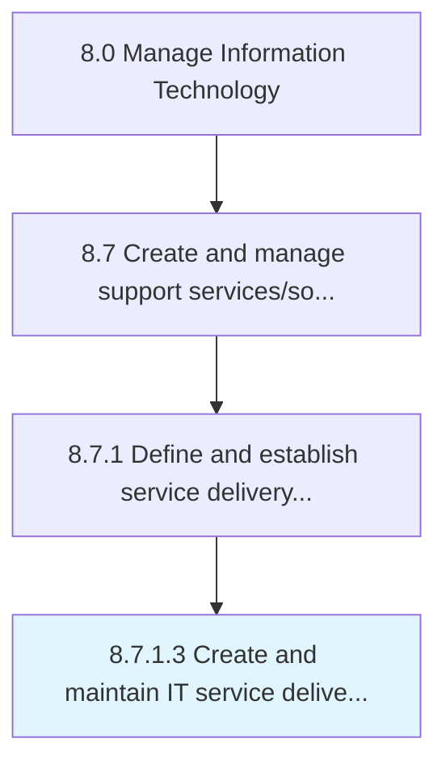

# Create and maintain IT service delivery model

> Design and maintaining an IT service delivery model that defines the processes and procedures needed to deliver the IT services and solutions.

## Overview

Activity 8.7.1.3 is an activity within the Manage Information Technology framework. 

Design and maintaining an IT service delivery model that defines the processes and procedures needed to deliver the IT services and solutions.

## Process Hierarchy



## Key Statistics

| Metric | Value |
|--------|-------|
| APQC Code | 20870 |
| Hierarchy ID | 8.7.1.3 |
| Level | Activity |
| Parent | [8.7.1](../) |
| Sub-Processes | 0 |


## GraphDL Semantic Structure

```
create.AndMaintainITServiceDeliveryModel
```

| Component | Value | Description |
|-----------|-------|-------------|
| Verb | `create` | Primary action |
| Object | `and maintain IT service delivery model` | Direct object |


## Related Concepts

- ITServiceDeliveryModel
- ITServiceDeliveryModel


---

*Source: APQC PCF 20870 (8.7.1.3) - APQC*
