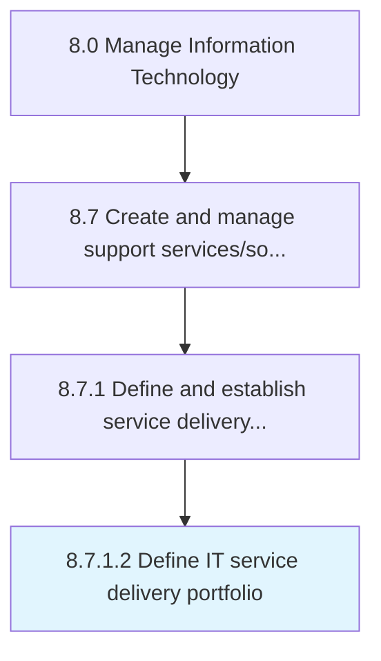

# Define IT service delivery portfolio

> Creating and establishing a repository of IT service delivery offerings.

## Overview

Activity 8.7.1.2 is an activity within the Manage Information Technology framework. 

Creating and establishing a repository of IT service delivery offerings.

## Process Hierarchy



## Key Statistics

| Metric | Value |
|--------|-------|
| APQC Code | 20869 |
| Hierarchy ID | 8.7.1.2 |
| Level | Activity |
| Parent | [8.7.1](../) |
| Sub-Processes | 0 |


## GraphDL Semantic Structure

```
define.ITServiceDeliveryPortfolio
```

| Component | Value | Description |
|-----------|-------|-------------|
| Verb | `define` | Primary action |
| Object | `IT service delivery portfolio` | Direct object |


## Related Concepts

- [ITServiceDeliveryPortfolio](/concepts/ITServiceDeliveryPortfolio)


---

*Source: APQC PCF 20869 (8.7.1.2) - APQC*
