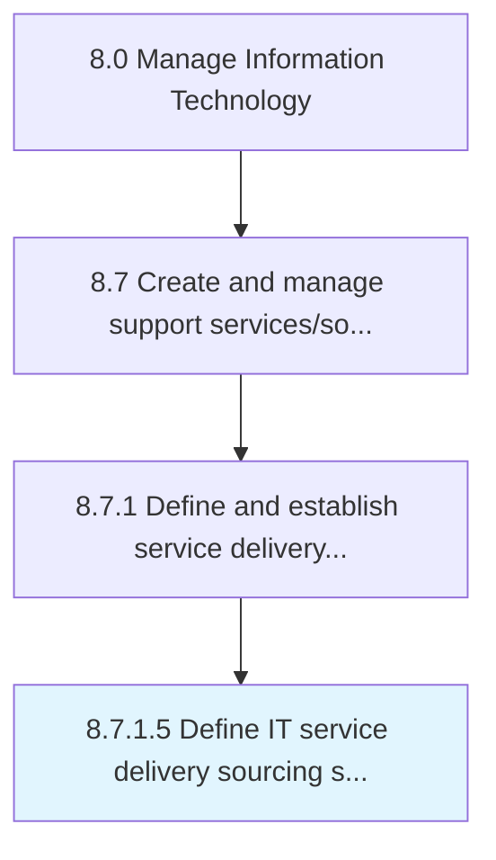

# Define IT service delivery sourcing strategy

> Defining a strategy for sourcing delivery of IT services and solutions.

## Overview

Activity 8.7.1.5 is an activity within the Manage Information Technology framework. 

Defining a strategy for sourcing delivery of IT services and solutions. Examine the pros and cons of various sources that can support the delivery process. Select the most feasible and cost-effective sources.

## Process Hierarchy



## Key Statistics

| Metric | Value |
|--------|-------|
| APQC Code | 20872 |
| Hierarchy ID | 8.7.1.5 |
| Level | Activity |
| Parent | [8.7.1](../) |
| Sub-Processes | 0 |


## GraphDL Semantic Structure

```
define.ITServiceDeliverySourcingStrategy
```

| Component | Value | Description |
|-----------|-------|-------------|
| Verb | `define` | Primary action |
| Object | `IT service delivery sourcing strategy` | Direct object |


## Related Concepts

- [ITServiceDeliverySourcingStrategy](/concepts/ITServiceDeliverySourcingStrategy)


---

*Source: APQC PCF 20872 (8.7.1.5) - APQC*
