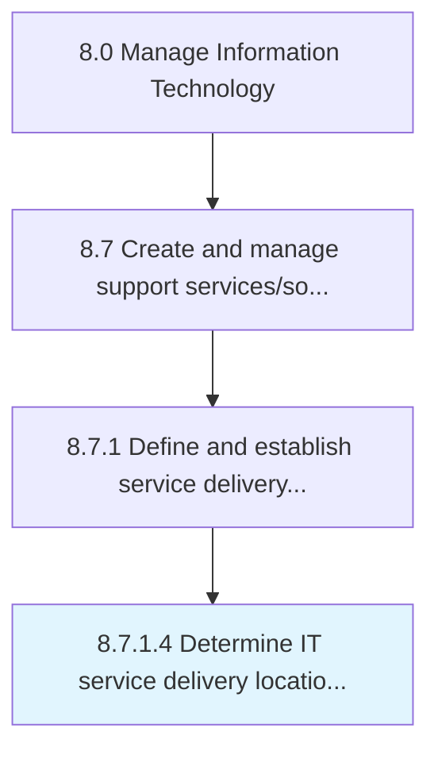

# Determine IT service delivery locations and activities

> Determining locations and types of IT services and solutions which need to be delivered.

## Overview

Activity 8.7.1.4 is an activity within the Manage Information Technology framework. 

Determining locations and types of IT services and solutions which need to be delivered.

## Process Hierarchy



## Key Statistics

| Metric | Value |
|--------|-------|
| APQC Code | 20871 |
| Hierarchy ID | 8.7.1.4 |
| Level | Activity |
| Parent | [8.7.1](../) |
| Sub-Processes | 0 |


## GraphDL Semantic Structure

```
determine.ITServiceDeliveryLocationsAndActivities
```

| Component | Value | Description |
|-----------|-------|-------------|
| Verb | `determine` | Primary action |
| Object | `IT service delivery locations and activities` | Direct object |


## Related Concepts

- [ITServiceDeliveryLocations](/concepts/ITServiceDeliveryLocations)
- [Activities](/concepts/Activities)


---

*Source: APQC PCF 20871 (8.7.1.4) - APQC*
