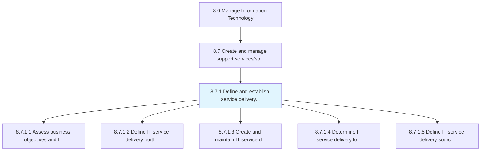
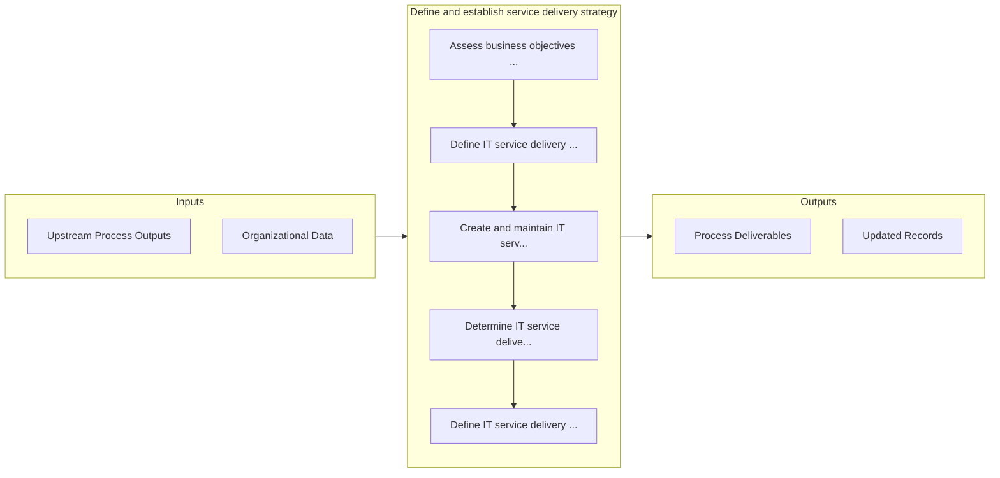

# Define and establish service delivery strategy

> Defining and establishing strategy for delivering IT services and solutions to the users.

## Overview

Process 8.7.1 is a core process that defines the specific procedures for define and establish service delivery strategy. 

Defining and establishing strategy for delivering IT services and solutions to the users. Design an IT service delivery model that defines the processes and procedures needed to deliver the IT services and solutions.

## Process Hierarchy



## Key Statistics

| Metric | Value |
|--------|-------|
| APQC Code | 20867 |
| Hierarchy ID | 8.7.1 |
| Level | Process |
| Parent | [8.7](../) |
| Sub-Processes | 5 |


## GraphDL Semantic Structure

```
define.AndEstablishServiceDeliveryStrategy
```

| Component | Value | Description |
|-----------|-------|-------------|
| Verb | `define` | Primary action |
| Object | `and establish service delivery strategy` | Direct object |


## Process Flow



## Sub-Processes

| Process | Hierarchy ID | Description |
|---------|-------------|-------------|
| [Assess business objectives and IT service delivery](./AssessBusinessObjectivesAndITServiceDelivery) | 8.7.1.1 | Assessing the goals and objectives of IT service delivery and how it contributes to the overall busi |
| [Define IT service delivery portfolio](./DefineITServiceDeliveryPortfolio) | 8.7.1.2 | Creating and establishing a repository of IT service delivery offerings |
| [Create and maintain IT service delivery model](./CreateAndMaintainITServiceDeliveryModel) | 8.7.1.3 | Design and maintaining an IT service delivery model that defines the processes and procedures needed |
| [Determine IT service delivery locations and activities](./DetermineITServiceDeliveryLocationsAndActivities) | 8.7.1.4 | Determining locations and types of IT services and solutions which need to be delivered |
| [Define IT service delivery sourcing strategy](./DefineITServiceDeliverySourcingStrategy) | 8.7.1.5 | Defining a strategy for sourcing delivery of IT services and solutions |


## Related Concepts

- ServiceDeliveryStrategy
- ServiceDeliveryStrategy


---

*Source: APQC PCF 20867 (8.7.1) - APQC*
