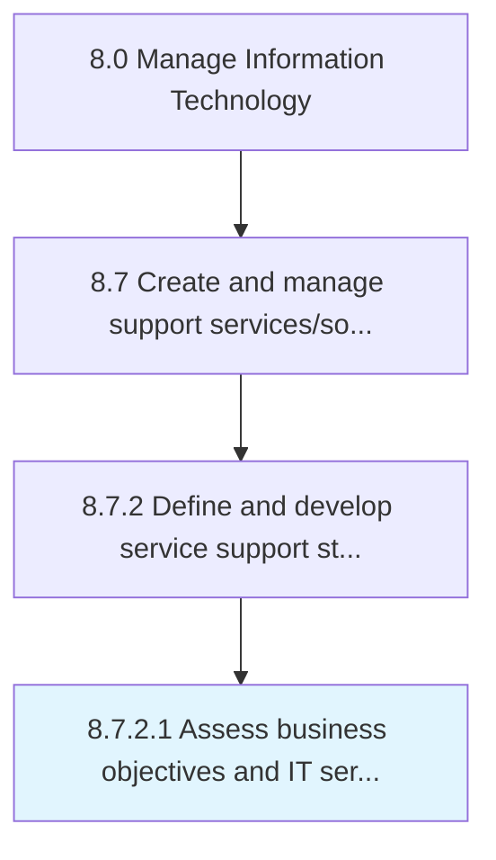

# Assess business objectives and IT service support delivery

> Assessing the goals of IT service support delivery and how it aligns to contribute to the overall business objectives.

## Overview

Activity 8.7.2.1 is an activity within the Manage Information Technology framework. 

Assessing the goals of IT service support delivery and how it aligns to contribute to the overall business objectives.

## Process Hierarchy



## Key Statistics

| Metric | Value |
|--------|-------|
| APQC Code | 20874 |
| Hierarchy ID | 8.7.2.1 |
| Level | Activity |
| Parent | [8.7.2](../) |
| Sub-Processes | 0 |


## GraphDL Semantic Structure

```
assess.BusinessObjectivesAndITServiceSupportDelivery
```

| Component | Value | Description |
|-----------|-------|-------------|
| Verb | `assess` | Primary action |
| Object | `business objectives and IT service support delivery` | Direct object |


## Related Concepts

- BusinessObjectivesServiceSupportDelivery
- ITServiceSupportDelivery


---

*Source: APQC PCF 20874 (8.7.2.1) - APQC*
