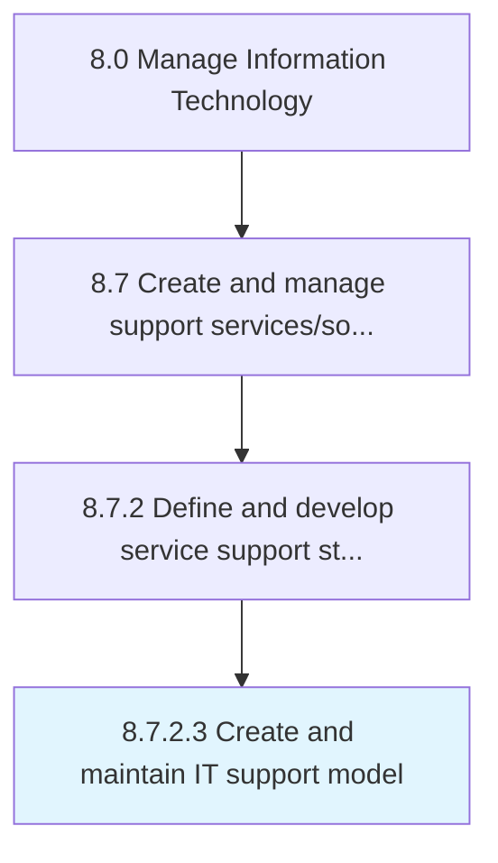

# Create and maintain IT support model

> Design and maintaining an IT support model that defines the processes and procedures needed to support users of IT services and solutions.

## Overview

Activity 8.7.2.3 is an activity within the Manage Information Technology framework. 

Design and maintaining an IT support model that defines the processes and procedures needed to support users of IT services and solutions.

## Process Hierarchy



## Key Statistics

| Metric | Value |
|--------|-------|
| APQC Code | 20876 |
| Hierarchy ID | 8.7.2.3 |
| Level | Activity |
| Parent | [8.7.2](../) |
| Sub-Processes | 0 |


## GraphDL Semantic Structure

```
create.AndMaintainITSupportModel
```

| Component | Value | Description |
|-----------|-------|-------------|
| Verb | `create` | Primary action |
| Object | `and maintain IT support model` | Direct object |


## Related Concepts

- ITSupportModel
- ITSupportModel


---

*Source: APQC PCF 20876 (8.7.2.3) - APQC*
