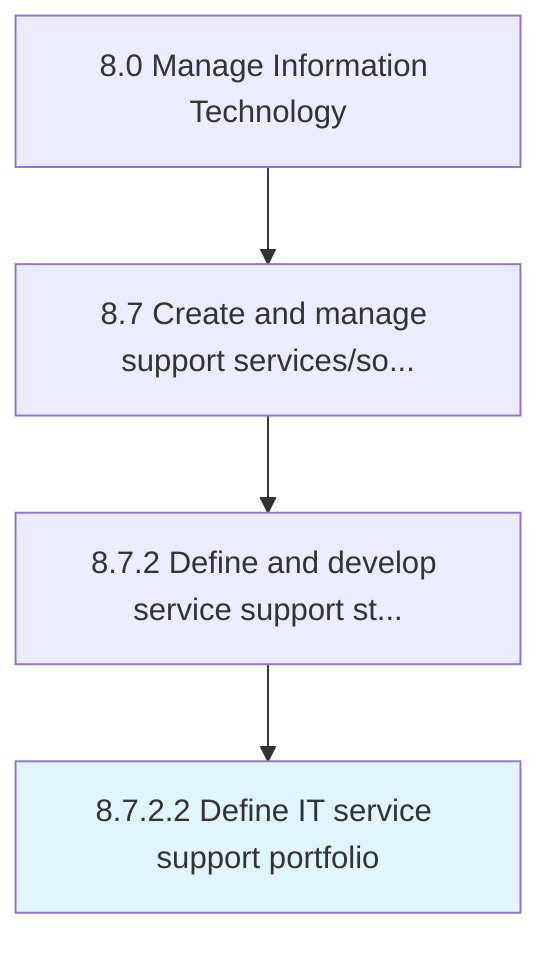

# Define IT service support portfolio

> Defining different IT support services and solutions such as remote support and cloud support.

## Overview

Activity 8.7.2.2 is an activity within the Manage Information Technology framework. 

Defining different IT support services and solutions such as remote support and cloud support. Include planned IT initiatives and ongoing IT services (such as application support).

## Process Hierarchy



## Key Statistics

| Metric | Value |
|--------|-------|
| APQC Code | 20875 |
| Hierarchy ID | 8.7.2.2 |
| Level | Activity |
| Parent | [8.7.2](../) |
| Sub-Processes | 0 |


## GraphDL Semantic Structure

```
define.ITServiceSupportPortfolio
```

| Component | Value | Description |
|-----------|-------|-------------|
| Verb | `define` | Primary action |
| Object | `IT service support portfolio` | Direct object |


## Related Concepts

- ITServiceSupportPortfolio


---

*Source: APQC PCF 20875 (8.7.2.2) - APQC*
