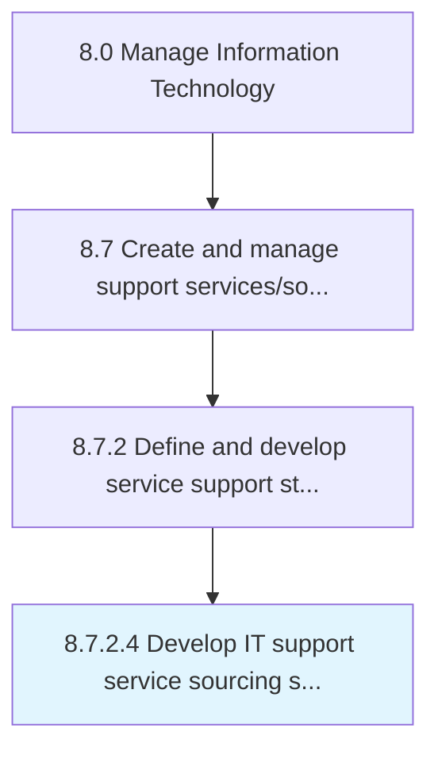

# Develop IT support service sourcing strategy

> Developing a strategy for sourcing resources to support users of IT services and solutions.

## Overview

Activity 8.7.2.4 is an activity within the Manage Information Technology framework. 

Developing a strategy for sourcing resources to support users of IT services and solutions. Establish sources that will make use of e-mail, live support software online, or a tool where users can log a call or incident in order to retrieve IT support.

## Process Hierarchy



## Key Statistics

| Metric | Value |
|--------|-------|
| APQC Code | 20877 |
| Hierarchy ID | 8.7.2.4 |
| Level | Activity |
| Parent | [8.7.2](../) |
| Sub-Processes | 0 |


## GraphDL Semantic Structure

```
develop.ITSupportServiceSourcingStrategy
```

| Component | Value | Description |
|-----------|-------|-------------|
| Verb | `develop` | Primary action |
| Object | `IT support service sourcing strategy` | Direct object |


## Related Concepts

- ITSupportServiceSourcingStrategy


---

*Source: APQC PCF 20877 (8.7.2.4) - APQC*
