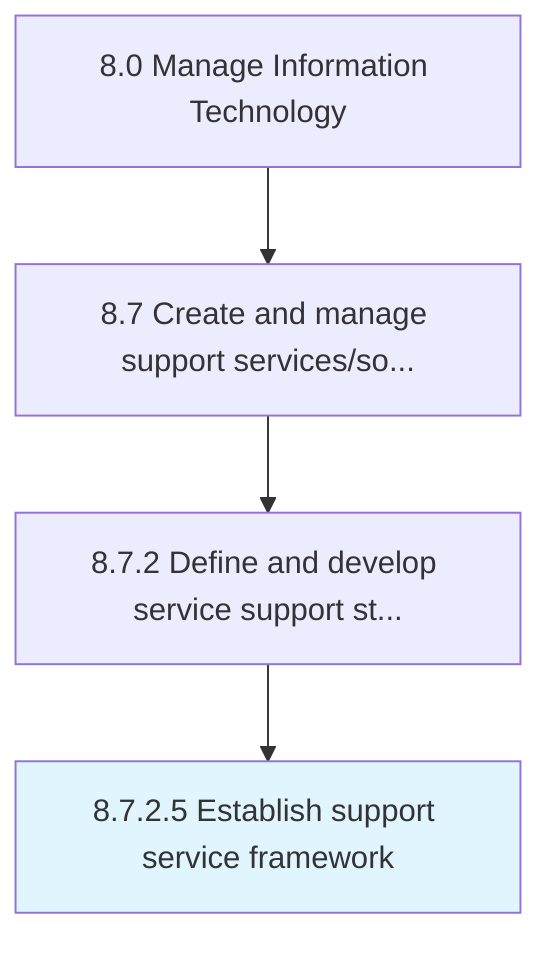

# Establish support service framework

> Creating an agenda for the rules and regulations of support service that deal with providing support to users of IT services and solutions.

## Overview

Activity 8.7.2.5 is an activity within the Manage Information Technology framework. 

Creating an agenda for the rules and regulations of support service that deal with providing support to users of IT services and solutions.

## Process Hierarchy



## Key Statistics

| Metric | Value |
|--------|-------|
| APQC Code | 20878 |
| Hierarchy ID | 8.7.2.5 |
| Level | Activity |
| Parent | [8.7.2](../) |
| Sub-Processes | 0 |


## GraphDL Semantic Structure

```
establish.SupportServiceFramework
```

| Component | Value | Description |
|-----------|-------|-------------|
| Verb | `establish` | Primary action |
| Object | `support service framework` | Direct object |


## Related Concepts

- SupportServiceFramework


---

*Source: APQC PCF 20878 (8.7.2.5) - APQC*
