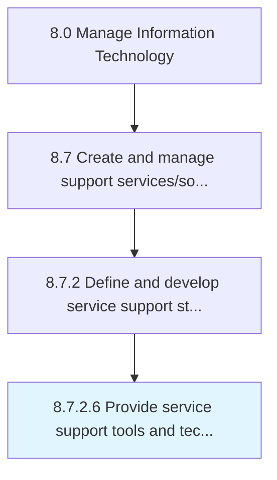

# Provide service support tools and technology

> Providing the tools and techniques to support users of IT services and solutions, and choosing the most appropriate tools and techniques.

## Overview

Activity 8.7.2.6 is an activity within the Manage Information Technology framework. 

Providing the tools and techniques to support users of IT services and solutions, and choosing the most appropriate tools and techniques. Evaluate the pros and cons of all the methodologies and tools available. Choose the most efficient and effective methodology.

## Process Hierarchy



## Key Statistics

| Metric | Value |
|--------|-------|
| APQC Code | 20879 |
| Hierarchy ID | 8.7.2.6 |
| Level | Activity |
| Parent | [8.7.2](../) |
| Sub-Processes | 0 |


## GraphDL Semantic Structure

```
provide.ServiceSupportToolsAndTechnology
```

| Component | Value | Description |
|-----------|-------|-------------|
| Verb | `provide` | Primary action |
| Object | `service support tools and technology` | Direct object |


## Related Concepts

- ServiceSupportTools
- Technology


---

*Source: APQC PCF 20879 (8.7.2.6) - APQC*
