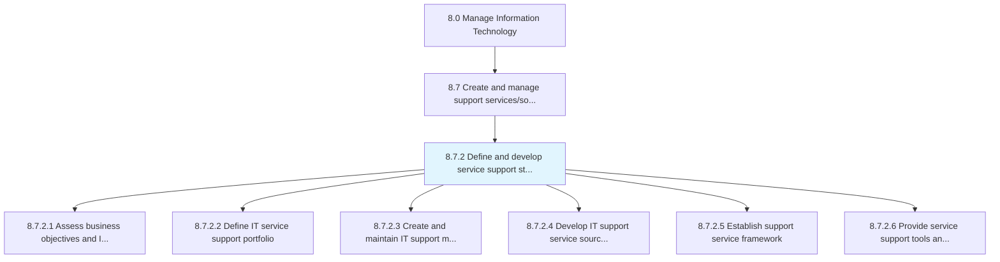
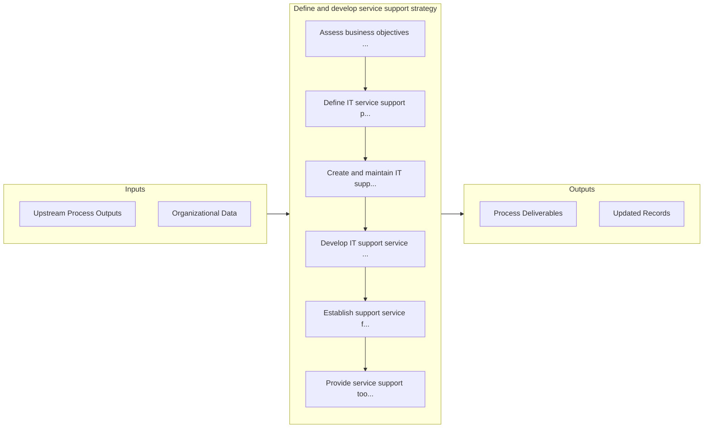

# Define and develop service support strategy

> Defining and creating a strategy for provision of support to users of IT services and solutions.

## Overview

Process 8.7.2 is a core process that defines the specific procedures for define and develop service support strategy. 

Defining and creating a strategy for provision of support to users of IT services and solutions.

## Process Hierarchy



## Key Statistics

| Metric | Value |
|--------|-------|
| APQC Code | 20873 |
| Hierarchy ID | 8.7.2 |
| Level | Process |
| Parent | [8.7](../) |
| Sub-Processes | 6 |


## GraphDL Semantic Structure

```
define.AndDevelopServiceSupportStrategy
```

| Component | Value | Description |
|-----------|-------|-------------|
| Verb | `define` | Primary action |
| Object | `and develop service support strategy` | Direct object |


## Process Flow



## Sub-Processes

| Process | Hierarchy ID | Description |
|---------|-------------|-------------|
| [Assess business objectives and IT service support delivery](./AssessBusinessObjectivesAndITServiceSupportDelivery) | 8.7.2.1 | Assessing the goals of IT service support delivery and how it aligns to contribute to the overall bu |
| [Define IT service support portfolio](./DefineITServiceSupportPortfolio) | 8.7.2.2 | Defining different IT support services and solutions such as remote support and cloud support |
| [Create and maintain IT support model](./CreateAndMaintainITSupportModel) | 8.7.2.3 | Design and maintaining an IT support model that defines the processes and procedures needed to suppo |
| [Develop IT support service sourcing strategy](./DevelopITSupportServiceSourcingStrategy) | 8.7.2.4 | Developing a strategy for sourcing resources to support users of IT services and solutions |
| [Establish support service framework](./EstablishSupportServiceFramework) | 8.7.2.5 | Creating an agenda for the rules and regulations of support service that deal with providing support |
| [Provide service support tools and technology](./ProvideServiceSupportToolsAndTechnology) | 8.7.2.6 | Providing the tools and techniques to support users of IT services and solutions, and choosing the m |


## Related Concepts

- [ServiceSupportStrategy](/concepts/ServiceSupportStrategy)
- [ServiceSupportStrategy](/concepts/ServiceSupportStrategy)


---

*Source: APQC PCF 20873 (8.7.2) - APQC*
