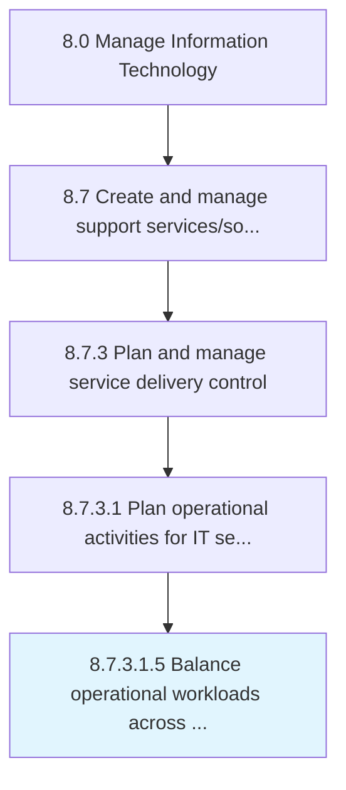

# Balance operational workloads across available infrastructure components

> Balancing workloads of all the processes and services that are provisioned to their internal or external clients, across available components of IT infrastructure.

## Overview

Sub-Activity 8.7.3.1.5 is an activity within the Manage Information Technology framework. 

Balancing workloads of all the processes and services that are provisioned to their internal or external clients, across available components of IT infrastructure. No component should be over or under utilized with the workflow of the IT operations.

## Process Hierarchy



## Key Statistics

| Metric | Value |
|--------|-------|
| APQC Code | 20886 |
| Hierarchy ID | 8.7.3.1.5 |
| Level | Sub-Activity |
| Parent | [8.7.3.1](../) |
| Sub-Processes | 0 |


## GraphDL Semantic Structure

```
balance.OperationalWorkloads.across.AvailableInfrastructureComponents
```

| Component | Value | Description |
|-----------|-------|-------------|
| Verb | `balance` | Primary action |
| Object | `operational workloads` | Direct object |
| Preposition | `across` | Relationship |
| PrepObject | `available infrastructure components` | Indirect object |


## Related Concepts

- OperationalWorkloads
- AvailableInfrastructureComponents


---

*Source: APQC PCF 20886 (8.7.3.1.5) - APQC*
