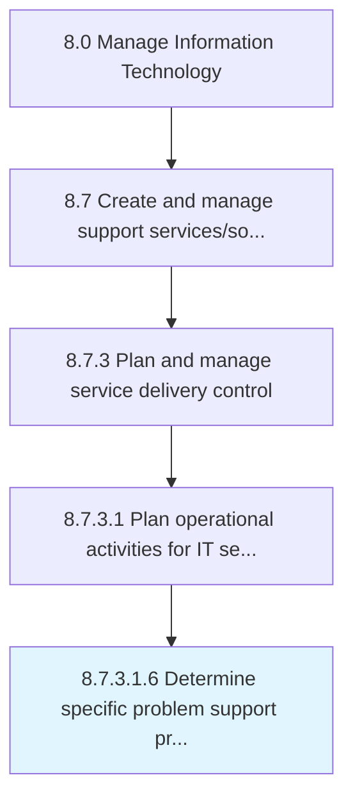

# Determine specific problem support procedures

> Determining process and procedure to provide support for specific IT service problems.

## Overview

Sub-Activity 8.7.3.1.6 is an activity within the Manage Information Technology framework. 

Determining process and procedure to provide support for specific IT service problems.

## Process Hierarchy



## Key Statistics

| Metric | Value |
|--------|-------|
| APQC Code | 20887 |
| Hierarchy ID | 8.7.3.1.6 |
| Level | Sub-Activity |
| Parent | [8.7.3.1](../) |
| Sub-Processes | 0 |


## GraphDL Semantic Structure

```
determine.SpecificProblemSupportProcedures
```

| Component | Value | Description |
|-----------|-------|-------------|
| Verb | `determine` | Primary action |
| Object | `specific problem support procedures` | Direct object |


## Related Concepts

- [SpecificProblemSupportProcedures](/concepts/SpecificProblemSupportProcedures)


---

*Source: APQC PCF 20887 (8.7.3.1.6) - APQC*
