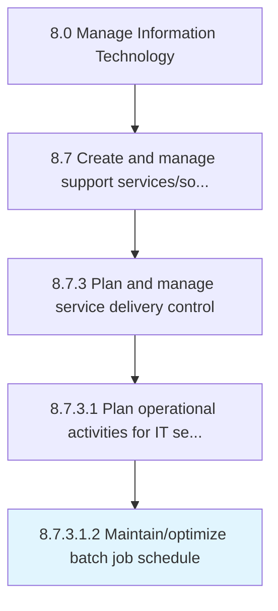

# Maintain/optimize batch job schedule

> Maintaining and scheduling batch jobs to run in the background at a certain date and time.

## Overview

Sub-Activity 8.7.3.1.2 is an activity within the Manage Information Technology framework. 

Maintaining and scheduling batch jobs to run in the background at a certain date and time.

## Process Hierarchy



## Key Statistics

| Metric | Value |
|--------|-------|
| APQC Code | 20883 |
| Hierarchy ID | 8.7.3.1.2 |
| Level | Sub-Activity |
| Parent | [8.7.3.1](../) |
| Sub-Processes | 0 |


## GraphDL Semantic Structure

```
maintain/optimize.BatchJobSchedule
```

| Component | Value | Description |
|-----------|-------|-------------|
| Verb | `maintain/optimize` | Primary action |
| Object | `batch job schedule` | Direct object |


## Related Concepts

- [BatchJobSchedule](/concepts/BatchJobSchedule)
- [BatchJobSchedule](/concepts/BatchJobSchedule)


---

*Source: APQC PCF 20883 (8.7.3.1.2) - APQC*
