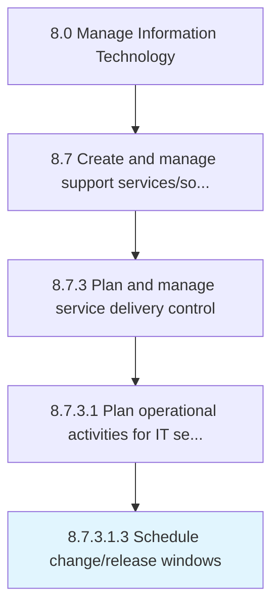

# Schedule change/release windows

> Determine the timely change or release of IT services or support.

## Overview

Sub-Activity 8.7.3.1.3 is an activity within the Manage Information Technology framework. 

Determine the timely change or release of IT services or support. Assign periodic release/change to IT systems or services.

## Process Hierarchy



## Key Statistics

| Metric | Value |
|--------|-------|
| APQC Code | 20884 |
| Hierarchy ID | 8.7.3.1.3 |
| Level | Sub-Activity |
| Parent | [8.7.3.1](../) |
| Sub-Processes | 0 |


## GraphDL Semantic Structure

```
schedule.ChangereleaseWindows
```

| Component | Value | Description |
|-----------|-------|-------------|
| Verb | `schedule` | Primary action |
| Object | `change/release windows` | Direct object |


## Related Concepts

- ChangeWindows
- ReleaseWindows


---

*Source: APQC PCF 20884 (8.7.3.1.3) - APQC*
